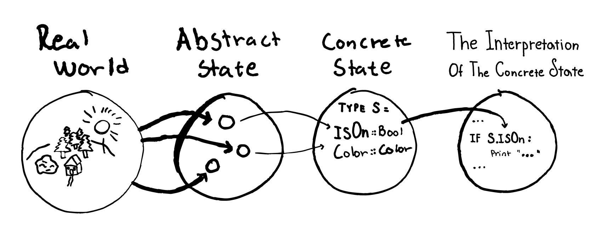
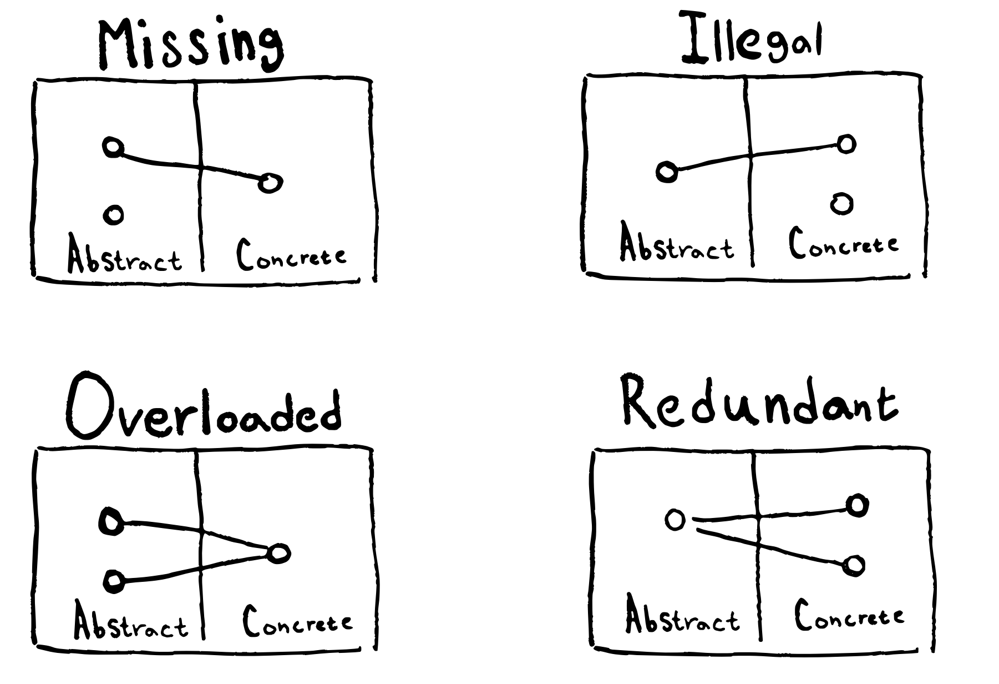
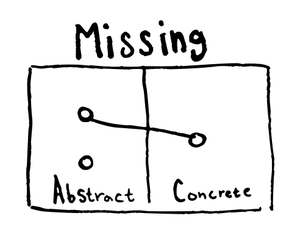
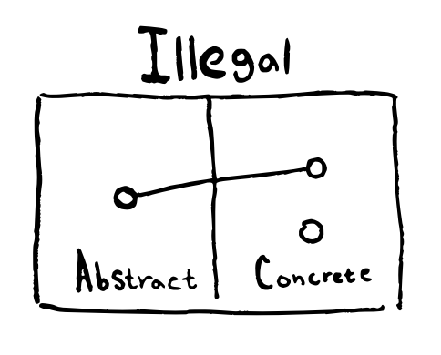
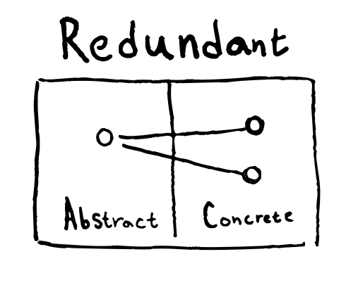
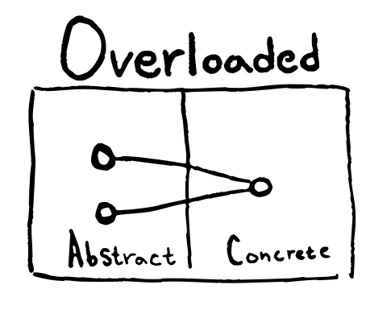
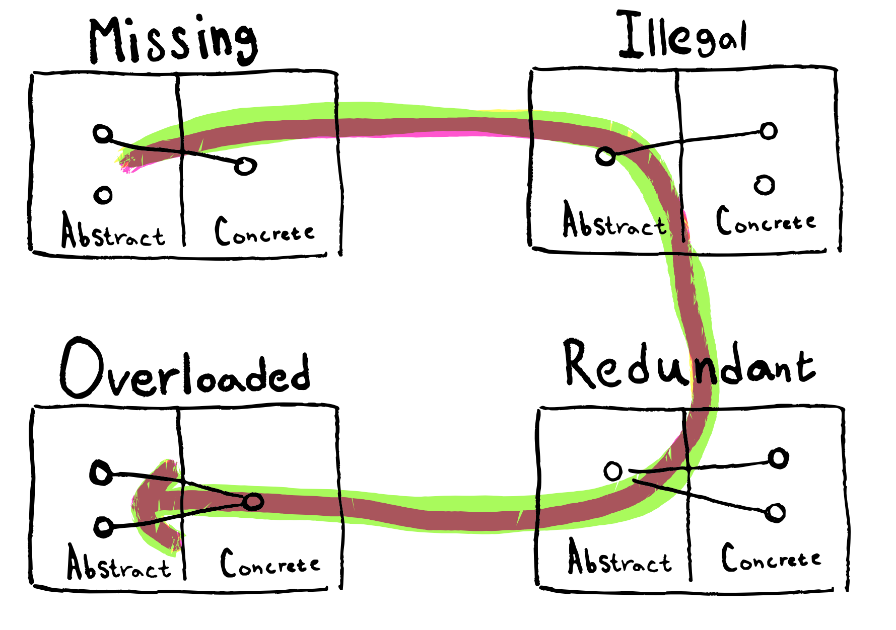
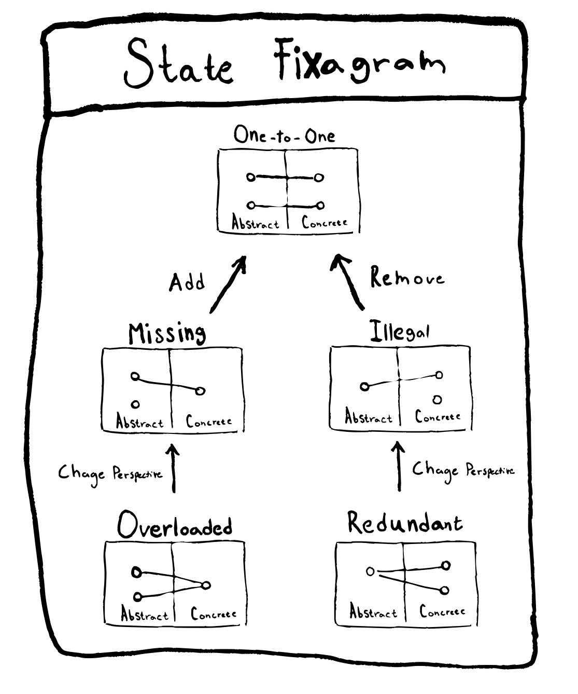

# Alert! Your state might already be infected!
What if I told you that while you are walking around all happy and content in these times of peace and great economic prosperity, your application state might be modeled wrong!

What if I told you I could help you with that, all while introducing another mnemonic to the world ?!?
Feel intrigued? Then keep reading!

# What is state anyway?
State is a description of how things are right now.

Examples:
* The oven is on.
* The traffic light is broken.
* The theme is set to dark-mode

# The four levels of state


State-space differs depending on which of these levels we are talking about. 
Let's dive in to see what they represent.

## The real world
The real world is messy and full of more details than we can even conceive. 
Imagine writing software for a washing machine.
The most apparent thing about it is that it has one or more knobs conveying different states. 

But it has more than that; it has a color, air inside, and hinges, screws, all in different shapes, sizes, and conditions. The list goes on. 

## The abstract state
>**The abstract state is a mapping from reality to a much simpler subset that still is useful to model what we are after.**

When it comes to data modeling, it's for us, the programmers, to select such a subset.
Continuing with the washing machine, maybe the only interesting states for our purposes are:

* is it On or Off?
* is it running?
* What program is it set to?

And we actively choose not to model 
* Electricity consumption
* More descriptive states like Stopped, Ready, Empty, Full,  Error.

**So what is an abstraction ?**

An abstraction is a mapping from a complex set to a simpler one, where operations and results in the abstract domain still tell us something relevant about the original set. 
That is precisely what we did above with our mapping from the real world to the abstract state. 

I first came across this idea of thinking of the abstraction mapping instead of "the abstraction" by reading Jimmy Koppel's article [Abstraction: not what you think it is](https://www.pathsensitive.com/2022/03/abstraction-not-what-you-think-it-is.html) .

I have been asked a few times about "what is a good abstraction?" so here is my current [favorite example](https://matt.might.net/articles/intro-static-analysis/).

Imagine a mapping (abstraction mapping) from the integer
`... -3, -2, -1, 0, 1, 2, 3, ...` to the set `{-, 0, +}`. This is the abstract domain.
Negatives to `{-}`, positives to `{+}` and 0 to `{0}`.

We can also map the `+` and `*` operators to versions operating on the abstract domain
```typescript
{+} + {+} = {+}    // A positive number plus a positive number is a positive number
{+} + {-} = {+, 0, -} 
{+} + {0} = {+}
{+} * {+} = {+}
{+} * {-} = {-}
{+} * {0} = {0}
etc...
```
Why do such a thing?

To perform a very simple static analysis of signs without having to evaluate a complete mathematical expression.

For example, we don't have to evaluate  `4 * -3` to know that the answer is negative. 

A short, sweet, and useful abstraction mapping in my opinion. 

So to tie this back together with the mapping between the real world and the abstract state. 
Just like we can create an abstraction mapping between the integers and the set of signs, we can create an abstraction mapping from the real world to our abstract state.
Our abstract state only contains the details we are after.
However, the operations and expressiveness in this more restricted domain still tell us useful things about the real world.

## The concrete state
>**The concrete state is the data types.**

The goal is to as close as possible have a one-to-one mapping between 
the abstract and the concrete state.

This to only allow states that should exist nothing more, nothing less.

Example 
```typescript
// Purposly a model with a lot of bad states
// Off and running ?

type State = {
	running : boolean,
	isOn: boolean,
	temperature: Celsius
}
```

## The interpretation of the concrete state
>**The interpretation of the concrete state is the code** **using the concrete state to produce your program.** 

Imagine you have a concrete state that can represent states that should not be allowed.
Then the solution you should **always** try first is to make your concrete state stricter. 
This is because if there is no way for your concrete state to represent illegal states, then the code using that concrete state also cannot represent those states.

While this is always the preferred solution, there are reasons to not follow this. 
* It might be very hard to capture the details of the abstract state in your concrete state, so you will have to resort to enforcing correctness in the code. 
  Example: Abstract state says that a list can only be of even length.
  Most languages will not be able to express such a thing in a reasonable way in the data type.
* A totally correct concrete state is not worth the performance impact.
* A totally correct concrete state makes the code much harder to work with, and the gains in correctness is not worth the price.

In all of these scenarios, it's an active choice to have an incorrect concrete state. This decision must be documented and well known. Code can/will change, and the compiler will not save you here.

If you have not made an active choice, then make sure your concrete state is correct.

This part touches on a much deeper topic of thinking about the logical level of your code. To learn more about that, attend the next cohort of [The Advanced Software Design Course](https://jameskoppelcoaching.com/advanced-software-design-web-course/) (one starts very soon!). For a primer read Jimmy's article [The Three Levels of Software](https://www.pathsensitive.com/2018/01/the-three-levels-of-software-why-code.html).

## The goals of data modeling ?
Make your mappings as close as possible to one-to-one between abstract and concrete and concrete and interpreted.

**Now on to the bugs!** 

# The four ways your state can be wrong! 
Now it's time to talk about how to spot and how to fix faulty states.
We will only look at the mapping between the `abstract state` and the `concrete state`. This is because any issues avoided or not avoided here will propagate onward.


There are four ways for the concrete state to be incorrect. I.e., not in a one-to-one mapping with the abstract state.
(The name of each incorrect mapping refers to the `concrete state.`)


## Missing


> We have **Missing** states when abstract states exist that the concrete state cannot express.

### How to spot? 
Requirements that should be straightforward but are not because our concrete state is not expressive enough to include that case.

The most common example is probably not having an `Error` state when one should. 

### How to fix?
> **Add unique concrete states**

Example
```typescript
// ### before ###

// function can blow up
const head = <A>(li: A[]) => li[0]

// ### After ###

// Function with extra concrete state
const head = <A>(li: A[]) => li.length > 0 ? just(li[0]) : nothing()

// Function with stricter abstract state input
// Now the bug cannot exist so we don't need it in our state
const head <A>(li: NonEmptyArray<A>): li[0]
```
## Illegal



> **illegal** states are states which have no mapping to an abstract state

You might have heard illegal states being talked about before, usually expressed as "Make Illegal States Unrepresentable".

There is a strong connection between **Illegal** states and **Redundant** states because sometimes it's just a matter of perspective. 

***Are extra keys in a map just redundant states or illegal states?*** 

### How to spot?
Say you are using some program, and there and in the settings, you see the following text *"only applies if extraFx is activated"*.

If you use that setting anyway without activating `extraFx` and you get undefined behavior, then the application contains **illegal** states. If the setting is just ignored when `extraFx` is not activated, then you have **redundant** states.


### How to fix?
> **Remove concrete states**

Make illegal states unrepresentable by removing possible states from your concrete state.

**Example**
`hyperBlur` and `extraRainEffects` are options under `extraFx`. 
```typescript
{
  extraFx: boolean,
  hyperBlur: boolean,
  extraRainEffects: boolean,
}
```

```typescript
/////////////////////////
// (extraFx, hyperBlur, extraRainEffects)
/////////////////////////

/////////////////////////
// The states we have: 8
/////////////////////////
(true,true,true)
(true,true,false)
(true,false,true)
(true,false,false)

(false,true,true)   ////////////////////
(false,true,false)  //  These are all illegal
(false,false,true)  //  
(false,false,false) ///////////////////

/////////////////////////
// the states we want: 5
/////////////////////////
(true,true,true)
(true,true,false)
(true,false,true)
(true,false,false)  // <-- Potentially also illegal depends on abstract state
(false,false,false) //     i.e does `extraFx` has some effect even without options ?

/////////////////////////
// Our new concrete state
/////////////////////////
type ExtraFxOptions = {
   hyperBlur: boolean,
   extraRainEffects: boolean
}

type Settings = {
 extraFx: Off | ExtraFxOptions
}

/////////////////////////
// Even stricter concrete state without the (true,false,false) state
/////////////////////////
type Settings = {
 extraFx: Off | ExtraFx<NonEmptyList<Options>>
}

```

Here is an example of illegal states in the [bitcoin codebase](https://github.com/bitcoin/bitcoin/blob/2f71a1ea35667b3873197201531e7ae198ec5bf4/src/coins.h#L112-L126). These are avoided by careful coding in the interpretation of the concrete state. Can you think of ways to make the state stricter and make bugs impossible?

## Redundant



>We have **Redundant** states when there is more than one way to represent one abstract state.

As mentioned before, **Redundant** states have a strong connection to **Illegal** states. 
It's easy to go from having **Redundant** states to having **Illegal** states; all that one has to do is interpret one of the extra redundant states the wrong way.

A easy way to add a **Redundant** state is adding a extra field to a map/object/record.
```typescript
type Person = {
     name        : string
   , age         : number
   , extraField : any
}

or

type Mood = Good | Bad | AlsoGood
```

The first kind is not as bad as the second because extra fields in records create a subtype of the previous type, so in many cases the code will function the same as long as nothing discriminates upon it. There however still are issues like, for example, an equality check that fails because of the value of a redundant field.

The second kind leads to real pain in scenarios like this: you can flip an image either by writing `new FlippedDrawable(image)` or `image.setFlipped(true)`.
Then, to check if an image is flipped, you need to look at both every time.

### How to spot?
Continuing with settings menu example from illegal.
Anytime an application has options that only apply in specific scenarios, but they are always possible to select, there are either illegal or redundant states.
Redundant if selecting them has no effect (noop).

### How to fix?
> **Remove concrete states**

**Example**
<br>
*Same example as in the illegal state, but seen from a different point of view.*
```typescript
/////////////////////////
// (extraFx, hyperBlur, extraRainEffects)
/////////////////////////

/////////////////////////
// The states we have: 8
/////////////////////////
(true,true,true)
(true,true,false)
(true,false,true)
(true,false,false)

(false,true,true)   ////////////////////
(false,true,false)  //  All of these map to the same abstract state 
(false,false,true)  //  As long as extraFx is false the other fields are ignored.
(false,false,false) ///////////////////

// Same...

```
## Overloaded 

> A state is **Overloaded** if we have one concrete state representing two abstract states.

This is probably the most common bug I run into when using software. 

### How to spot?
Have you ever used a piece of software, and the following occurs?

1. There is text saying "no messages | likes | etc..."
2. A second later, the data does pop up. 

If you have, then you have observed the effect of overloading.

Both Slack and Twitter have had this bug.
[How elm slays a common UI Antipattern](http://blog.jenkster.com/2016/06/how-elm-slays-a-ui-antipattern.html)

### How to fix?
> **Add unique concrete states**

Say you have a model like this
```typescript
type State = {
  isLoading: boolean,
  data: List<number>
}
```

Then there is no way to differentiate these two abstract states
* Empty list because nothing was returned from the backend
* Empty list because we have not asked for it yet

If we ask ourselves what states should exist for data fetched from a backend, it becomes clear that these four states are a better abstract description of what is going on.
```typescript
type state = NotAsked | Loading | Success<List<number>> | Failure<string>
```

If we instead use this as our concrete state there would be a distinction between `NotAsked` and `Success<List<number>>`, which there wasn't before. 

Depending on our abstract state requirements, we can take this further or be happy with this. 

*How would you change the model to allow for pagination while keeping the current data you already have?*


## I was promised a mnemonic! Where is it?
I will give you two for the price of one!

> **When designing your data model avoid MIRO concrete states**

If you don't like avoiding the painter [MIRO](https://www.wikiwand.com/en/Joan_Mir%C3%B3) spilling paint all over your code, then change **Redundant** to **Superfluous**, and you got **MISO** Soup! Don't drop **MISO** in your code! *(For a quick demonstration of the effects, pour some MISO soup into your computer and see what happens!)*.

### M -> I ->  R -> O


<br>
If this article intrigued you and you like thinking deeply about software you should consider joining the *Advanced software design course*. That is where I started as a student and learned the deeper foundations that underlay all software. That knowledge led me to the ideas that underlay this article.
<br>
**The next batch of the Advanced Software Design course starts on the 23 of June. [Click here to join](https://jameskoppelcoaching.com/advanced-software-design-web-course/).**


## Introducing the State Fixagram™!
I will leave you with this easy-to-follow **Fixagram™**. 
Next time you find yourself with an invalid state, don't fret! Just follow the **Fixagram™**, and you will be alright.
**No need for a state of emergency!**

