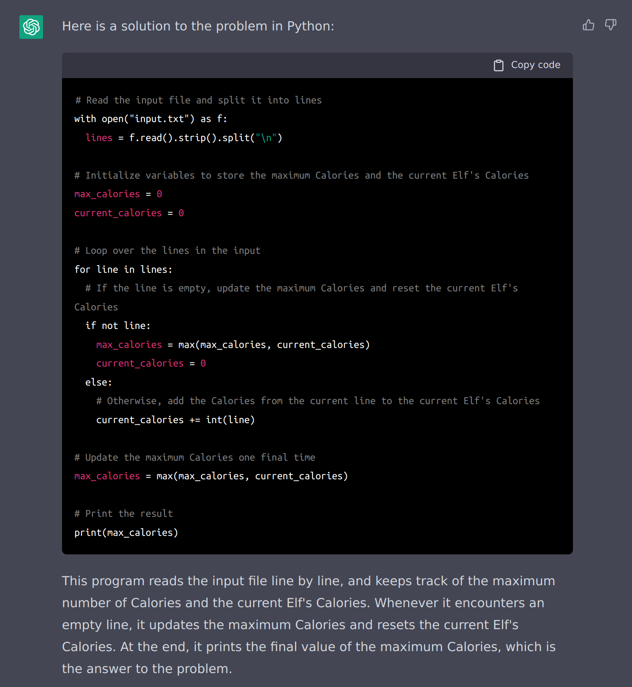

# Intro
It feels like every week a new mindblowing Ai assistant pops up, tools like D-alle, Whisper, Copilot etc. 
Have all been amazing and useful to me. 


</div>
Yesterday I saw this tweet about using GPT chat.


<blockquote class="twitter-tweet"><p lang="en" dir="ltr">OMG WTF <a href="https://t.co/I2hE0e5ppq">pic.twitter.com/I2hE0e5ppq</a></p>&mdash; cts (@gf_256) <a href="https://twitter.com/gf_256/status/1598104835848798208?ref_src=twsrc%5Etfw">December 1, 2022</a></blockquote> 

I had never tried GPT chat and this got me very keen in doing so!
I quickly tried it on some of the code examples we use in our courses as examples of hard-to-find bugs or 
code in need of refactoring and I was more than amazed that one code challenge that 
1/100 engineers find was found 'easily' by GPT chat and it also provided the suggested refactor to remove it.

Today Advent Of Code started so I'm naturally curious how far I can come with minimal guidance of these code-writing Ais. 

If you want to do the challenges yourself or with your Ai friend visit [Advent Of Code](https://adventofcode.com/2022/). 


**Bots at my disposal**
* [CoPilot](https://github.com/features/copilot)
* [GPTchat](https://chat.openai.com/chat)

Let's Go!


## Day 1

[Question](https://adventofcode.com/2022/day/1), [Input](https://adventofcode.com/2022/day/1/input), Ai used:[GPTchat](https://chat.openai.com/chat)

### Day1: Challenge 1
I wrote a little instruction on where to find the question that needed to be answered, that I wanted the answer printed, and please don't use any libraries.

Then I just pasted the whole question in full to the GPT chat.


And lo and behold, GPT produced the following program



<details>
<summary>code</summary>

```python
# Read the input file and split it into lines
with open("input.txt") as f:
  lines = f.read().strip().split("\n")

# Initialize variables to store the maximum Calories and the current Elf's Calories
max_calories = 0
current_calories = 0

# Loop over the lines in the input
for line in lines:
  # If the line is empty, update the maximum Calories and reset the current Elf's Calories
  if not line:
    max_calories = max(max_calories, current_calories)
    current_calories = 0
  else:
    # Otherwise, add the Calories from the current line to the current Elf's Calories
    current_calories += int(line)

# Update the maximum Calories one final time
max_calories = max(max_calories, current_calories)

# Print the result
print(max_calories)

# This program reads the input file line by line, and keeps track of the maximum number of Calories and the current Elf's Calories. Whenever it encounters an empty line, it updates the maximum Calories and resets the current Elf's Calories. At the end, it prints the final value of the maximum Calories, which is the answer to the problem.
```

</details>
</br>

I copied the code and ran it on my machine, I ran and produced a number!
**I pasted the number into Advent Of Code as the answer and it was the correct answer!
Wow...**


#### Day1: Challenge 2

On the second part of the challenge I yet again just pasted the whole page of information, 
But this time I was way less precise in my instructions.

One of the features of GPT chat is that it remembers! So I wanted to use that 
and act as if I was basically talking to a human.


I pasted this as my prompt

... Drumroll!

The initial answer was this. 


I yet again took the code and ran it on my machine.
...
It gave me an answer and I was hopeful!
I pasted it into the website and... Wrong answer!
No...
What now ? do I just run it again and hope for a better result ?

That is not how I would have done it with a human programmer, let's try the same here. 
Advent Of Code gave me a hint that the answer was too low so I just told GPT chat the same thing.


This is pretty mindblowing, now only does the new solution work, but it also tells me 
what was wrong with the other one! 

I have not even understood the challenge myself, since I have not even read it.
But GPT3 chat was able to use my prompt to 'reason about' the previous answer and how to fix it.

Amazing. 

Day one complete! See you tomorrow!


### Day 2 (stay tuned)