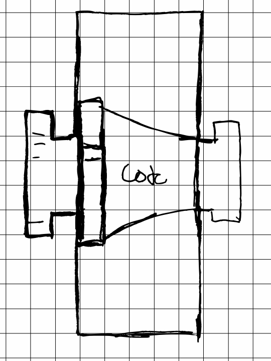
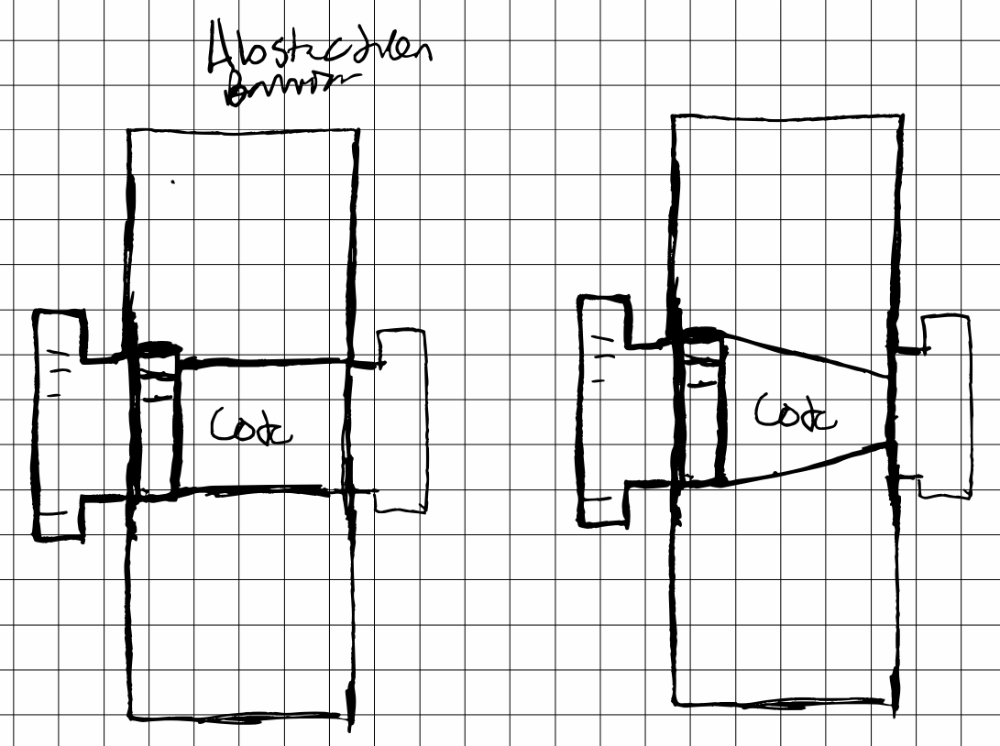

# Tunnel Vision: How modularity lies beyond the code


_DALL-E : "Super Mario" using green pipes as sunglasses in stained glass art_

This will be a multi-part series where we will see how far we can drive the tunnel/pipe analogy in explaining the three levels of code and how the pre- and postconditions of code relate to modularity ( i will explain those terms later)

In this first section, we will focus on the **Specification**.

## Background

When we teach Hoare Logic in our Advanced Software Design course. It can be tricky with the limited time we spend on the topic for the students to develop intuition about how different types of pre- and postconditions affect the modularity of the program.  So we will here attempt to provide that intuition with the help of the humble tunnel. We won't go into Hoare logic in this post but will instead just focus on pre-and postconditions.

* A Precondition is a condition that must be fulfilled for other things to happen. 
* A post-condition is an assertion on what is true after a piece of code has run

```typescript
{x is a number}
y = prime_checker(x)
{if x is prime then y = "is_prime" else y = "is_not_prime"}
```
if this level of detail is not needed we can choose a weaker assertion (both pre and post-conditions are assertions, logical facts that are true at some point in time)

```typescript
1. {x is a number}
2. y = prime_checker(x)
3. {if x is prime then y = "is_prime" else y = "is_not_prime"}
4. {y = "is_prime" | "is_not_prime"}
5. {y is string}
6. y = toUpperCase(y)
7. { y is a upper case string}
8. { y is a string }
9. print(y)
10. {p has been printed}
```

On line 4 we just weaken the logical statement saying `y` is either `"is_prime"` or `"is_not_prime"`. 
We weaken it further and say it's just a string. 
Now all the information from the `prime_checker` is gone. 
This is a game we play on the logical level based on what we believe we will need for the rest of the program. 

if we later need to do some discrimination on the values of y and want to know it can only be those two values, then that information needs to be carried forward in the program. 

This type of assertion is what is happening and changing in your brain all the time when you are reading and writing code. 

This gives a good indicator of why code with a lot of conditionals is error-prone and difficult to keep in your head. 
the size of that assertion will double with every if statement. 

So at this point, it's enough to know that you can write or think about this type of specification surrounding each piece of code. You might also write it down in comments around your functions for example

```typescript
{c is a char, str is a string, amount is a number bigger or equal to zero}

const leftPad(c, str, amount) ...

{
1.  The length of the output is `max(n, len(str))`
2.  The prefix of the output is padding characters and nothing but padding characters
3.  The suffix of the output is the original string.
}
```

For see real formal proofs of leftpad check out this project
https://github.com/hwayne/lets-prove-leftpad

Even if the program does not throw any error if we now call `leftPad` with a number less then 0.
There is still a bug, a logical-level bug. Since we are not following the specification the post-condition is not guaranteed. 
And `leftPad` is allowed to change how it handles this at any time because it's not part of any specification how this should act.

It's totally fine to restrict Apis by specifying this kind of restrictions.
However the more that design can be embedded into the code the better. 

It's not a particularly good idea to allow any input to your [programs](https://www.wikiwand.com/en/Robustness_principle).
We will later get a visual understanding of how we can always make a API looser on input and stricter on output. But not the other way around so if you have allowed a very wide input space you will have to continue to support that or suffer the consequences. 

This is why browsers have such a hard time enforcing strict correct HTML. because they did not do that from the beginning and now literally millions of sites will break if they start being HTML spec-compliant. 

[link to don't break you apis]

To not have to break you api think about how little you can get away at the start. The 'build what you need' mantra. Aslong as future possible changes are easy to add.

Okey let's get to the TUNNELS !


## The concept of a tunnel

If i could i would use this cool super mario tunnel for all my illustrations. But my drawing skills are a bit to crappy at this time. 


The important part of a pipe/tunnel is that you can stack them along as one tunnel fits into the other.


We will stretch this analogy of tunnels and pipes pretty far in this discussion, and it's just ment as a mental aid in starting to think about the logical level of the code. 


### Specing out the spec

Let's start of the level of logic and then at the end of the article mix in code to think about extensiblity and contraction of software. 

A specification expresses what needs to be true before a piece of code is called and what is true after.

The details are very important. 

Even for a humble `toUppercase` function  there is probably a lot of implied details. like the string needs to have the exact same characters but uppercase. 

There recently was a serious bug in a piece of software where a function had this spec
```
The record has x amount of y in it's record.
```

But what was actually needed was 

```
The record has x amount y in in it's record AND nothing else!
```

In this case it was a serious bug because the code checked that the right amount of the wanted values where present but it was possible to add an arbitrary amount of extra values of non checked keys that could be used for exploits later down the line. 

This is the case everytime one works with records, because a record with extra fields is a subtype of the wanted type. 


### How specs compose. 


#### Base spec


#### Accept more inputs and allow less outputs


#### Accept less inputs, allow more outputs


### Are the types the spec ?

Sometimes but not most times. 

For example the `toUpperCase` function has the type 
`string -> string`

We can think a hugh amount of other string manipulation function that has that signature. `toLowerCase` for example. so clearly the types are not the spec. 

But i did say sometimes. So there are cases where we can capture the the spec in the type

In typescript for example we can write this type 
`string -> Uppercase<string>` . 

While we are closer, but who says it's the same string or that the string has not been doubled in length. 

`<S extends string>(s: S): Uppercase<S>`

This is closer :) 

The spec is all the details that 'matter' other details can be said to be implementation details. (people will depend on you implementation details so be warned)

A fun example we have in the course is that the free function could look like this 
```c
{x is a piece of alocated memory}
free(x){ /* Do NOTHING !*/}
{x cannot be used anymore}
```
if you now use `x` you are breaking the spec. 
Even with a implementation that marks the memory to be free for the OS to use, it could be a good idea to scramble the memory aswell, so code that does break the spec and use the memory will crash early. To avoid the simcity situation where a new version of windows had to ship with fallback mode to a old memory allocator to make up for a bug in simcity. 


```

```

### The shape of tunnels

You probably have just thought about tunnels that are symetrical. for our needs think more of a tunnel like this 

[Tunnel with smaller entrance then exit]

This analogy will take us pretty far but in reality (if anything is real) the shape a tunnel takes in is multidimensional. We will take it a bit further in the end to see a bit of this, but thinking in the simple 2D/3D plane is good enough for our needs. 


### What is inside the tunnels, show me!?

Here is where it gets funky... More tunnels!
The Tunnels represents the "state space" you code is allowed to operate in. 

If your specification expresses that you will let out numbers less then 5 and your code only let's out numbers less then 3 then that implementation is still valid. 


A argument can take many shapes. 
What is the shape of this statement ?
```
x = 5
```

Well it depends! we could say that 
```
{ x = 5 }
```
and our state space would be very small.

or we could say that 
```
{ x is a number }
```
and the size of the state space will be much larger. 

if we now have a function 

```
{true}
x = 5
{x = 5 }
print("number is 5")
{x = 5, 5 has been printed to the screen}
```

This line of code is only correct if we have the stricter requirement on x. 
that means that we cannot change x to another number and the program would still be correct, instead we would also have to change the print statement. 

if the specification instead looked like
```
x = 5
{x = 5}
{x is a number}
print("number is " + x)
{x = 5, a number has been printed to the screen}

```

# PART 2, THE CODE!


### Where is the Code ? 


#### What if i told you there is no spec ? 
The specification that we saw in the earlier post does not really 'exist'!.
It's just an idea. 

So the walls are not so solid as they seem, let's instead go inside the specification
and look at what is really leading the water in there. 

The code ! 

The code needs to make sure it can collect the all the water from the specification 
and lead it through the program. 

The spec tells us the boundaries that our code can move in. 
But it's the code that needs to follow the spec. 

In the above animation you see how the water leaks out even though the specs 
match. This is because the code does not respect the post condition and is to 
loose in what it let's out. 

This gives you the second level of flexibility. 
If your specification for example says that the return type is async. 
You have room to make a sync code implementation and just a async return value. 

This is the interplay between specs and code. 

If you have a specification that does not fit the code exactly you have room to move. 

In Hoare Logic we talk about precondition strengthning and post-condition weakening, and how that relates to a form of modularity. 

* The output of your precondition is the input of your code
* The output of the code is the input to the postcondition.

So the interplay between the precondition and the code is the same as between
the postcondition of a spec and the precondition of the next spec. 

This is where a lot of the inflexibility comes from. 
You can always make your precondition wider but the code might need to change aswell. 

If you have pretty forgiving code but a strict spec you could change the spec without changing the implementation. 

example 
Before
```typescript
{a and b are number}
const add = (a,b) => a + b
```

After
```typescript
{a and b are positive number}
const add = (a,b) => a + b
```

`positive number` implies `number`

It's not strictly true sometimes you will have todo a selection to get out 
the old value that your code needs 

Before
```typescript
{defender is a Creature, attackNumber is a number}
const applyDamage(defender, attackNumber) => ...
```

After
```typescript
{defender is a Creature, attacker is a Creature}
const applyDamage(defender, attacker) => ...
```

There the code will have to do something like `attacker.getAttackValue()` to function like before.


## What is stronger and what is weaker ? 

You might ask yourself how you determine if you are strengthening or weakening you pre/postconditions.
if the new value is a subset of the old value is strengthening.

### From PRIME to NUMBER

### CALLER

if your function changes from only taking `prime numbers` to `numbers`. 
That is a weakening, you are making the assertion tunnel(precondition) wider.
All the old callers still work because their current values are a subtype of the current
new type. The code however might need to change, since there now is more possible values
that the function accepts. Chances are that this code might already work for number 
since all prime number are numbers, and this means that the old spec was stricter
then it 'had' to be. 

[Venn diagram showing primes within number]()

### CALLEE

If you do this action to the postcondition all the old values beeing produced by
the code still fits but other specs using the output might no longer work if there was 
no room to play with there.

If you change from `number` to `prime number` that is strengthening.
Less values are allowed to be passed in, you are making the tunnel 


### From Number to Prime
### CALLER

if we go the other way around. 
And we have a spec that now accepts number and we want to change that to prime. 
Now we are breaking the API for callers. 
since their old numbers may not be prime. 

Stronger    =>   Weaker
`Prime`     =>   `Number`

So we are now doing precondition strengthening.

### CALLEE

For callees the story is ofcourse opposite.
we are making our output more narrow, into a strict subset. 
So all callees and other specs that worked with our old version still works.

## Code looser input than spec



## Code stricter output than spec.



## What is hoare logic 

```
{}
```

But you should really think about it more as 

```typescript
{potentially stricter preconditon}
{real precondition}
code
{real postcondition}
{potentially weaker postconditon}
```

This allows you to create a little barrier of flexbility if you like
you can say that the two "potentially" assertions is the exact same as default.
but you do have the ability to stretch things there and give more space to the implementation.
```typescript
-------------- SPECIFICATION -------------
{potentially stricter preconditon}
---------- ABSTRACTION BARRIER -----------
------------------ CODE ------------------
{real precondition}
code
{real postcondition}
------------------ CODE ------------------
---------- ABSTRACTION BARRIER -----------
{potentially weaker postconditon}
-------------- SPECIFICATION -------------
```

## Weakest precondition ? 

Means that the spec is exactly as wide as the input of the code.


## Strongest postcondition ? 


## Ok ok so what is the water ?
The water as a whole represents all possible executions of the program. 
Your code restricts it's flow and makes sure it does not leak. 
The specification tells what bounds the code should be within. 

A single water droplet is one execution, what you would see if you
open a debugger. 


## Error of modular reasoning

> If we have bugs in the code but there is not execution around to see them
> do we still have bugs ? 

The answer is YES! because the current set of executions and the current
layout of the code is not guaranteed. 
The only thing that is guaranteed is if we follow the specification, or we will 
have to change the specification . 

Let me visualize a error of modular reasoning that does not lead to any bugs. 

