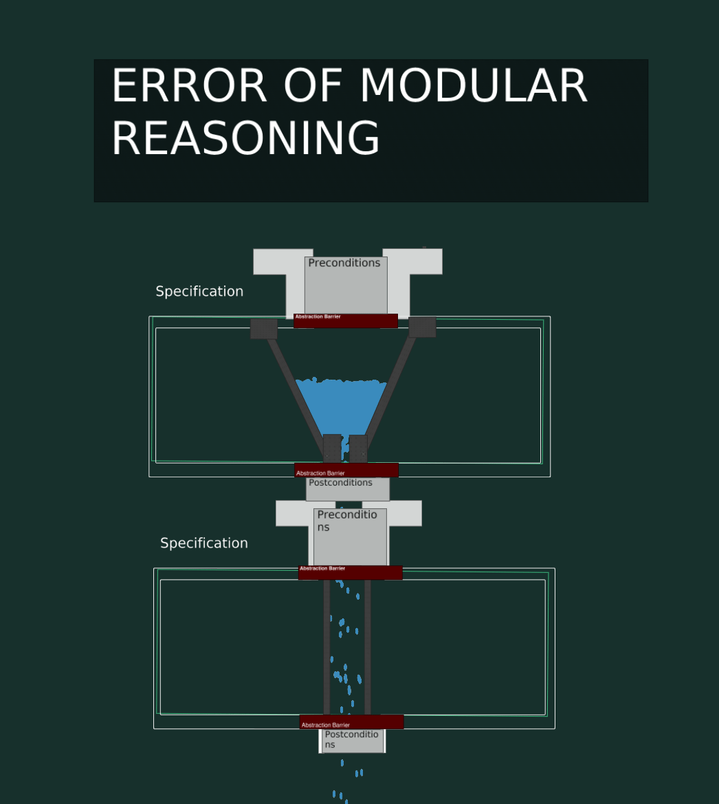
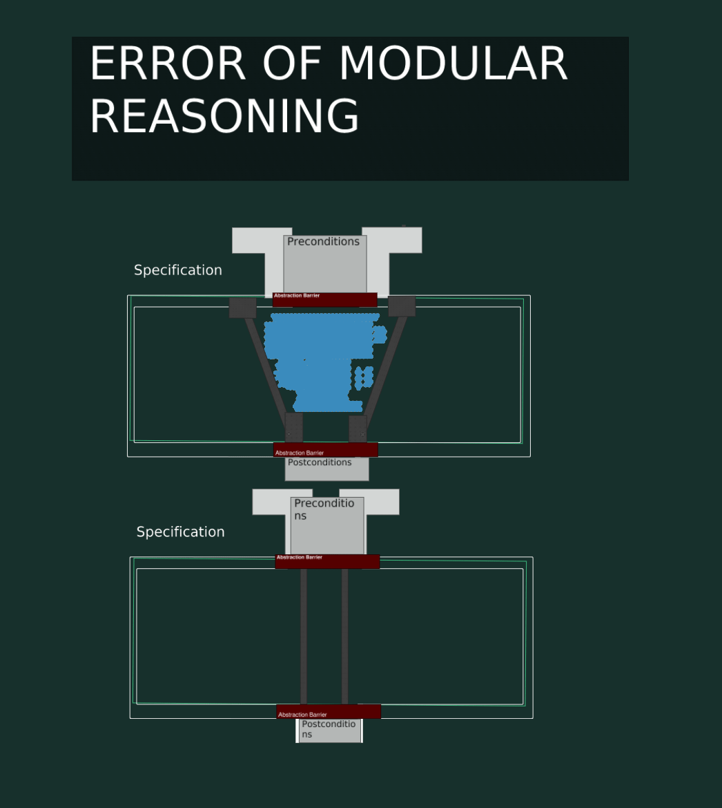

# Pipe Dream | API breakage visualized


<div style="font-style: italic; margin-top: -20px; padding-bottom: 10px;" class="text-sm text-center pb-4">
DALL-E : "Super Mario" using green pipes as sunglasses in stained glass art
</div>

When I first took our course (Yes I started as a student) and learned about Hoare Logic (more on that later).
I was blown away by the power of the concept, And it served very useful in getting me to lift my head from the code and think about the design of the program.
That said, what about the details ? there are a lot of rules in hoare logic that are logically sound, but how do from thinking in rules to the rules falling out as obvious from your understanding of the problem ?

I hoped there was some simple visual representation of what was going on so I setup a background task in my brain to work on this problem to find a good way to internalize this field of knowledge.
After probably 12 months with some failed visualizations on the way i found something that is both simple, intuitive and accurate. And now i'm finally writing it down to share with you.

So, get ready, because I'm about to introduce you to the Pipe!

### Pipes

The idea of a Pipe is not particularly new, anyone that has done just a little bit of linux command line
or functional programming has run into the pipe operator (even comming to JS?!?). But the idea of a pipe is much more general then that. What we are going to exploit is how pipes fit and don't fit together.

## Pipes and Software

Code exists on one of [three levels](https://www.pathsensitive.com/2018/01/the-three-levels-of-software-why-code.html).

1. The runtime level
2. The code level
3. The logical/specification level

And what pipes together with water will allow us to do is to get a visual understanding of how these levels interact.
When we first tell students that always produce the correct results but can still be wrong they are often confused.
After this post I believe you will have a much better understanding of what that means.

We will also get an understanding of the inverse of multiple implementations for the same interface.
Multiple interfaces for the same code, which is usually less appreciated.

### Speed running the logical level of code

```typescript
const add = (a, b) => a + b
```

Is this code correct?

...Well, what does it even mean for code to be correct ?
If we don't have a specification we can't say anything about correctness.

So let's add a specification.

```typescript
// add is a function that takes two numbers and returns a those numbers added together
const add = (a, b) => a + b
```

Is this code correct? by visual inspection, yes!

Where is the bug in this code?

```typescript
const hello_ = "hello_"
const world = "world"
const hello_world = add(hello, world)
console.log(hello_world)
```

First of, we forgot to say what the aim of the program is. But we can probably guess that it's to print "hello_world" to the console.
But we can't say that for sure, so let's add a specification.

```typescript
// This program prints "hello_world" to the console
const hello_ = "hello_"
const world = "world"
const hello_world = add(hello, world)
console.log(hello_world)
```

It produces the correct output, so it must be correct, right?
This is where the logical level comes in.
Let's put the specification of add in the code.

```typescript
// This program prints "hello_world" to the console
const hello_ = "hello_"
const world = "world"
// add is a function that takes two numbers and returns a those numbers added together
const hello_world = add(hello, world)
console.log(hello_world)
```

Are we abiding by the specification of add? No, we are not.
Yet the program still works! What gives!

<b>
The problem is that we are not using the specification of add.
We are using the implementation of add.
</b>

So what, it works!
Well what if we change the implementation of add? it's our right as programmers to do so.
Maybe we just wrote the first implementation that came to mind and we want to improve it.

```typescript
// add is a function that takes two numbers and returns a those numbers added together
const add = (a, b) => {
  if (typeof a !== "number" || typeof b !== "number") {
    throw new Error("inputs must be numbers")
  }
  return a + b
}
```

Now our program breaks, at both the runtime level and code level, and we have to go back and fix it!
Yet we did no changes to our specification, and our new implemenatiton is also correct.
So what is going on?

(code level is one execution of the program that fails. Could be found with exaustiv testing., runtime is that a particular execution fails, the one we are running right now)

### Pipes and water

What we call that bug where a program works but it's not obeying the specifications of code it uses.
Is a "Error of modular reasoning"
modular reasoning is defined as

> Being able to make decisions about a module while looking only at its implementation, its interface and the interfaces of modules referenced in its implementation or interface.
> https://www.igi-global.com/dictionary/modular-reasoning/40536

So a error of modular reasoning is when that is not the case.
We cannot prove the code correct without looking at the particular implementations that might give more guarantess or work for more values (strings aswell in our case) instead of just the specifications of each piece of code.

#### Pre and post conditions

Specifications has two parts, what needs to be true before the function is called
and what is true after it has been called. **Everything else is an implementation detail!**
These conditions are called pre and post conditions.
and here is how we would write them for add.

```typescript
// precondition: {a is a number, b is a number}
const add = (a, b) => {
  if (typeof a !== "number" || typeof b !== "number") {
    throw new Error("inputs must be numbers")
  }
  return a + b
}
// postcondition: {return is a added to b}
```

But better still is to think of it without the implementation details.
like this

```typescript
// precondition: {a is a number, b is a number}
const add = (a, b) => { ... }
// postcondition: {return is a added to b}
```

Any implementation that meets these conditions is correct.

### Hoare logic and logical implication

What hoare logic does is to allow us to reason about the correctness of code by looking at the pre and post conditions of the code we are using.
So we can get hard and fast rules how we can change our code without breaking the conditions.
OR! how we can change our conditions and still have the old code working.

The first implmenation of add we wrote

```typescript
const add = (a, b) => a + b
```

is correct, but the current precondition is not the weakest precondition, the implementation allows.
The weakest precondition is that a and b are any values for which a + b is defined.
maybe not so useful, but a bit stricter is that a and b are numbers or strings.
and maybe the operation should be called concat instead (Hello semigroup, fp-fans will be happy).

#### Weak and strong ?

We call a condition weaker if it requires or gives less guarantees.
We call a condition stronger if it requires or gives more guarantees.

This can be modeled with logical implication.
If we have a implementation that works for strings and numbers, then we can use it for numbers.
A stronger condition implies a weaker condition.
Sometimes conditions (assertions acutally) don't imply each other at all, then there is not relationship.
But when there is a relationship we can use it to reason about our code, and API breaking changes.

The bug in the code we had earlier was that we did not repsect the specification of add.
We used the implementation instead. However, on way to "solve" this is to change the specification to
work in this case aswell. Would this be a breaking change or a non-breaking change for all other callers ?
I will show you a easy visual way to understand this.

But before this, two i'm gonna answer two question you might haven now.

1. This code is untyped! if we had types you would not be able to call add with strings in the first place.
   Is types on the logical level ?
   Types also follow logical implication (explore on your own, it's fun), and they embed some of the logical level in the code level. but not all (that depends on the power of the typesystem though)

2. Should you make your implementation act as close as possible to the specification ?
   > With a sufficient number of users of an API,
   > it does not matter what you promise in the contract:
   > all observable behaviors of your system
   > will be depended on by somebody.
   > -- [Hyrum's Law](https://www.hyrumslaw.com/)


So what gives ? if your code gives more guarantees then the spec says, then some users will surley depend on that.
And if you change the code to be more in line with the spec, then you will break those users (buhuu).
Go famously made their map itteration random, because a lot of users where writing code depending on itteration
beeing in order. Something that was not guaranteed in the spec, but was the case in the implementation.
So they randomized the itteration order, to just not imply that stricter spec. And be open for more optimizations in the future.

So it would be totally possible todo similar things where, if your current implementation is sync for example but
later you might not want to guarantee that, well make it trivially async now, by wrappign the return value in a promise.
Then you can change the implementation later, without breaking the spec.

When you stake out your spec, you are creating space to move in.
Do not give to much guarantees or be to nice with possible inputs from the get go.
You will have to honor that forever, and if you don't you will break users.
This is basically counter to the robustness principle, which to me sounds like a recipe for fraile software.

So how do we get a visual understanding of this?

## THE PIPE!

If i could i would use this cool super mario pipe for all my illustrations. But my drawing skills are the limiting factor.


The important part of a pipe is that you can stack them along as one pipe fits into the other.


These pipes represents our different specifications.
They take in some inputs and give out some outputs.
If we want to change our pipes/specifications there are two ways we can do this that always works.


No old callers/pipes can break, when we do these types of changes.
But the oppsite is always a breaking API change.
Breaking an API is a logical level statement, it's still a breaking change
even if you know all the current callers will continue to work.

In the image the last pipe could strengthen is precondition, but that would be a breaking change.
even though we see it will work in this parcticular case.

Let's work this intuition with these series of animations.

### How specs compose.

#### Base spec

Here we have two specs that are composed togheter.
The water represents all possible runs, while each drop is a single run.
so with this we capture the runtime level, the code level and the logical level.


We see the water passes through the specs without any leakage so we have a working program.

#### A valid change

Let's accept a wider input range (weaker precondition) and give a more narrow output range (stronger postcondition)


#### A breaking change


Here we see what happens when we try to give less guarantees (weaker postcondition) and take less input (stronger precondition).
The water leaks out, and we have a broken program.

In controlled circumstances where we know all the callers, say like in a senario
where we have not published some library with unknown users, but instead might just
have a few functions defined in our program we can sometimes do this kind of thing without
breaking the logical level.
But any public facing API you should imagine there beeing all possible callers, that
need the full width of your input range and expects nothing more then the current width of your output range.

### Shapes! Is this all a pipe dream ?

Our curent analogy takes us pretty far but in reality (if anything is real) the shapes of the inputs/outputs are multidimensional.
Aka you say you want something super specific that our water analogy can't capture.
but thinking in the simple 2D plane is good enough for our needs.

### Where is the code, show me!?

For this we need something... More pipes!
The outer pipe represents the "state space" you code is allowed to operate in.

If your specification expresses that you will let out numbers less then 5 and your code only let's out numbers less then 3 then that implementation is still valid.


#### What if i told you there is no spec ?

The specification that we saw in the earlier post does not really 'exist'!.
It's just an idea.

So the walls are not so solid as they seem, let's instead go inside the specification
and look at what is really leading the water in there.

The code !

The code needs to make sure it can collect the all the water from the specification
and lead it through the program.

The spec tells us the boundaries that our code can move in.
But it's the code that needs to follow the spec.

In the above animation you see how the water leaks out even though the specs
match. This is because the code does not respect the post condition and is to
loose in what it let's out.

This gives you the second level of flexibility.
If your specification for example says that the return type is async.
You have room to make a sync code implementation and just a async return value.

This is the interplay between specs and code.

If you have a specification that does not fit the code exactly you have room to move.

In Hoare Logic we talk about precondition strengthning and post-condition weakening, and how that relates to a form of modularity.

- The output of your precondition is the input of your code
- The output of the code is the input to the postcondition.

So the interplay between the precondition and the code is the same as between
the postcondition of a spec and the precondition of the next spec.

This is where a lot of the inflexibility comes from.
You can always make your precondition wider but the code might need to change aswell.

If you have pretty forgiving code but a strict spec you could change the spec without changing the implementation.

example
Before

```typescript
{a and b are number}
const add = (a,b) => a + b
```

After

```typescript
{a and b are positive number}
const add = (a,b) => a + b
```

`positive number` implies `number`

It's not strictly true sometimes you will have todo a selection to get out
the old value that your code needs

Before

```typescript
{defender is a Creature, attackNumber is a number}
const applyDamage(defender, attackNumber) => ...
```

After

```typescript
{defender is a Creature, attacker is a Creature}
const applyDamage(defender, attacker) => ...
```

There the code will have to do something like `attacker.getAttackValue()` to function like before.

## What is stronger and what is weaker ?

You might ask yourself how you determine if you are strengthening or weakening you pre/postconditions.
if the new value is a subset of the old value is strengthening.

### From PRIME to NUMBER

### CALLER

if your function changes from only taking `prime numbers` to `numbers`.
That is a weakening, you are making the assertion tunnel(precondition) wider.
All the old callers still work because their current values are a subtype of the current
new type. The code however might need to change, since there now is more possible values
that the function accepts. Chances are that this code might already work for number
since all prime number are numbers, and this means that the old spec was stricter
then it 'had' to be.

[Venn diagram showing primes within number]()

### CALLEE

If you do this action to the postcondition all the old values beeing produced by
the code still fits but other specs using the output might no longer work if there was
no room to play with there.

If you change from `number` to `prime number` that is strengthening.
Less values are allowed to be passed in, you are making the tunnel

### From Number to Prime

### CALLER

if we go the other way around.
And we have a spec that now accepts number and we want to change that to prime.
Now we are breaking the API for callers.
since their old numbers may not be prime.

Stronger => Weaker
`Prime` => `Number`

So we are now doing precondition strengthening.

### CALLEE

For callees the story is ofcourse opposite.
we are making our output more narrow, into a strict subset.
So all callees and other specs that worked with our old version still works.

## Code looser input than spec


## Code stricter output than spec.


## What is hoare logic

```
{}
```

But you should really think about it more as

```typescript
{potentially stricter preconditon}
{real precondition}
code
{real postcondition}
{potentially weaker postconditon}
```

This allows you to create a little barrier of flexbility if you like
you can say that the two "potentially" assertions is the exact same as default.
but you do have the ability to stretch things there and give more space to the implementation.

```typescript
-------------- SPECIFICATION -------------
{potentially stricter preconditon}
---------- ABSTRACTION BARRIER -----------
------------------ CODE ------------------
{real precondition}
code
{real postcondition}
------------------ CODE ------------------
---------- ABSTRACTION BARRIER -----------
{potentially weaker postconditon}
-------------- SPECIFICATION -------------
```

## Weakest precondition ?

Means that the spec is exactly as wide as the input of the code.

## Strongest postcondition ?

## Ok ok so what is the water ?

The water as a whole represents all possible executions of the program.
Your code restricts it's flow and makes sure it does not leak.
The specification tells what bounds the code should be within.

A single water droplet is one execution, what you would see if you
open a debugger.

## An error of modular reasoning visualized

The main point of the [The three levels of software](https://www.pathsensitive.com/2018/01/the-three-levels-of-software-why-code.html) is that programs that never goes wrong can still be wrong. How can this be ? And how can we create a mental model for it.

I will show you that it's maybe not so strange a concept after all and is just a natural emerging fact of the interplay between multiple subprograms/tunnels.

#### What is a stable guarantee ?

Senior programmers talk about stable guarantees, what the mean about that is only depending on the specification and not a particular current implementation that might have some behavior that will not always be guaranteed.

#### Are these bugs ?

> If we have bugs in our code but there is not execution around to see them
> do we still have bugs ?

The answer is YES! And i think many would agree on that

What about this

> If no possible execution of our code can cause a bug, can we still have bugs ?

Maybe!
The above line is probably too cryptic to be informative, just make it fit into
that word pattern.

Some alternative formulations would be.

> If our code depends on a particular implementation detail do we have a bug ?

Yes!

There are two ways to have an error of modular reasoning.

1. Depending on a stricter output than the specification guarantees.
   Examples is the use after free bug. in SimCity where code used memory after it was freed, but the program still worked by coincidence because the current implementation of the memory manger in Windows was stricter than the specification. And did not touch the memory after it was freed. So code depending on it still worked. Until the next release of Windows.

   In GO a similar issue is avoided by randomizing the order of map itterations to make developers not depend on the order of the keys.
   https://stackoverflow.com/questions/55925822/why-are-iterations-over-maps-random

2. Depending on beeing able to use looser input than the specification guarantees.
   Maybe the current implementation is more forgiving than the specification guarantees. And depending on that is also an error of modular reasoning.

A simple example of this would be this code.

```typescript
// Spec:
// a, b are numbers between 1 and 10
const add = (a, b) => a + b

console.log(add(15, 25))
```

Both of these errors is something that will only come up when code changes, so
no observable issues can be found in the current code.

In some cases it's possible to embed the spec in the types and then, these type
of logical error can be made into compile time errors.

### What does this mean visually ?

This code has a error of modular reasoning.
The second function depends on the current implementation and not the specification.



This should be a valid change but now we get a runtime error in our program.


### Code -> Tunnel

Show some code, then the same code but 'wrapped' in a tunnel to show how one can see this in regular programs.
