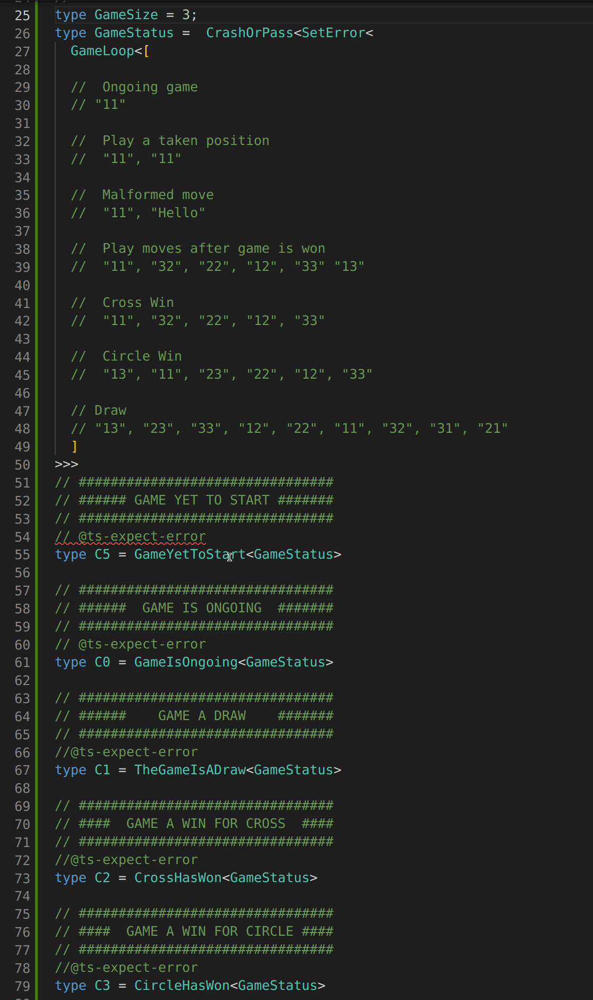

At Mirdin we help students to practice writing software. You might be familiar with how practicing guitar or some sport is very different from just playing/performing.

You will get better from just playing but it takes much longer and your understanding of what you have learned is much worse. You will learn what to do but have a harder time explaining what you have learned.   

It's exactly how it normally is to work towards becoming a senior engineer. Senior engineers that have been through a lot gain intuition. They know that one design decision should be taken over another but they might have a hard time explaining exactly why. So do you really have to spend 10 000 hours just working on projects to 
achieve mastery ?


At Mirdin we believe there is a more effective way.
We try to give meaning behind every design decision to not have to use gut feeling or past experiences with similar design decisions to have an opinion on what direction to take.

One way we do this is by giving students a series of short design exercises that takes just a few hours to finish but will contain a lot of opportunities for things to go wrong. Then we give the students immediate feedback on how their earlier design choices affected later requirements. With smaller groups or private students, we design specific requirements for each implementation that are meant to poke holes at a student's design. 

The Tic-Tac-Toe challenge is not exactly in this vain but instead gives students the challenge to write a Tic-Tac-Toe program that cannot go wrong, and produce compile time errors for as many incorrect uses as possible. For example, playing with the same player twice. 

When I was a student at Mirdin a few years ago I decided to try to write Tic-Tac-Toe completely on the typelevel in Typescript. This proved to be very challenging but fun. I have now expanded on that initial attempt and written this post to explain how it works in the hope to teach some more advanced typelevel Typescript.
And maybe also make you interested in doing something similar for fun.

I have a lot to thank the excellent Type-Challenges for helping me learn enough type-level trickery to get it done. 
https://github.com/type-challenges/type-challenges

### Where to find the code
To play along,  here is a Typescript playground of the code.
https://tinyurl.com/typelevel-tic-tac-toe

The latest code can also be found on Github.
https://github.com/note89/typelevel-tic-tac-toe/blob/master/tic-tac-toe.ts

## First A Demo!

There is gonna be a lot of code so to peak your interest let me present you with the end result.
A UI for playing Tic-Tac-Toe on the typelevel where type errors are used display the state of the game and provide feedback for correct play.

```typescript
// ##################################
// ##################################
// #          Play a Game           #
// #              of                #
// #          Tic-Tac-Toe           #
// ##################################
// ##################################
// 
// This is my attempt of a decent UX (hehe).
// 0. Select game board size (3x3, 4x4, 5x5, etc) 
// 1. Cross will be the first to move
// 2. Just enter coordinates.
// 
// The status checks below will turn RED 
// To show what state the game is in.
//
// Illegal moves will be compile-time errors
// with decent error messages.
```




##  Requirements  

If you would like to give this a try yourself, here are the requirements.

Design an API for a Tic-Tac-Toe board, consisting of types
representing states of the board, along with functions 
`move`, `takeMoveBack`, `whoWonOrDraw`, and `isPositionOccupied`.

* All functions must be pure
* All functions must return a sensible value and may not throw exceptions
* A move can only be made if
  - the game is not over
  - the player is the current player
  - the `move` is valid (i.e. not already played)
* Calling `TakeMoveBack` on a board with no moves is a compile-time error
* Calling `WhoWonOrDraw` on a tic-tac-toe board but the game has not finished is a compile-time error
* `IsPositionOccupied` works for in-play and completed games.

## Some extra design decisions
I wanted the game to be possible to play on boards of any size, (3x3, 4x4, 5x5, etc).
To achieve this winning positions need to be calculated from `Size` instead of hard-coded. 
This is possible but a bit fiddly. I have not yet achieved the ability to have two games of different `Size` in the same project. To do that I would have to parameterize the program a bit more, this is something to try in a later version (famous last words). 

## Show me the code! 

The reason this is written in Typescript is that it's the language I know best, and also the language I want to get better at the most but also Typescript has a bunch of typelevel features that very few other mainstream typed languages have. 

We will go through the code top to bottom, except for the "UI" code, which will be left for last.
There are a lot of comments in the code that are also meant to explain the program, so I will reuse them here.

### Utils
Let's start with some utility functions that will be used in multiple other types.

```typescript
// CartesianProduct<X,Y>
// Example: 
// CartesianProduct<"a" | "b", "c" | "d"> = ["ac", "ad", "bc", "bd"]
type CartesianProductString<T extends ToStringableTypes, T2 extends ToStringableTypes > = `${T}${T2}`;

type ToStringableTypes = string | number | boolean | bigint;
```

A goal in the program is that as much as possible of the types are derived from other more basic types. 
The `CartesianProduct` function is used to produce coordinates between `Rows` and `Columns` for example.

```typescript
// UnionToIntersection<X>
// Takes a union like `A | B | C` and returns an intersection like `A & B & C`
type UnionToIntersection<U> = 
  (U extends any ? (k: U)=>void : never) extends ((k: infer I)=>void) ? I : never
```
This is a bit of an interesting trick that you can encounter if a few different type-level functions (`Equal` for example).
But putting the type parameter in the argument position to a function we change how Typescript will reconcile the type for  `I`.
`I` become an intersection of all the types in `U`. 

```typescript
// Example: ToUnion<[1,2,3]> = 1 | 2 | 3
type ToUnion<T extends any[]> = T[number]

// Zip two arrays together
// Example: Zip<[1,2,3],["a","b","c"]> = [[1,"a"],[2,"b"],[3,"c"]]
type Zip<T extends any[], U extends any[], Acc extends any[] = []> = 
  T extends [infer Head, ...infer Tail] ? 
  U extends [infer Head2, ...infer Tail2] ? 
  Zip<Tail, Tail2, [...Acc, [Head, Head2]]> : Acc  : Acc;

// Join tuples together to strings
// Example: StringConcatTuples<[[1,2],[3,4]]> = ["12","34"]
type StringConcatTuples<T extends [number, number][]> = {[Key in keyof T]: `${T[Key][0]}${T[Key][1]}`};
```
`ToUnion` is purely to have a nicer API that explains better what is being done.
Zip is a quite simple recursive function looking very much like the code version would, there is some neater ways where you would infer both heads and tails at once. 
https://github.com/type-challenges/type-challenges/issues/4495

But with that implementation Typescript fails to do type inferencinging later in the program.
`StringConcatTuples` is so we can use coordinates as keys, and do a lookup from coordinate to a square.

With many of these more exotic recursive types, there is a limit to how far they will work and 
sometimes there are issues, which means you will have to try something different.
A recursive type in Typescript 4.5 has a max callstack of [`999`](https://github.com/microsoft/TypeScript/pull/45711/files#diff-d9ab6589e714c71e657f601cf30ff51dfc607fc98419bf72e04f6b0fa92cc4b8R15233)


#### Arithmetic 

In a `3x3` game, `11,22,33` form a diagonal, in a `4x4` game the diagonal is `11,22,33,44`. 
Any player that has one of these diagonals has won the game.

To be able to derive diagonals and other winning positions from  `Size` we need the ability to do some
math on the typelevel. Luckily that is very possible in Typescript.
Our needs contain only the ability to do plus and minus one. This ability will allow us to perform 
typelevel loops.

The comments from the code tell most of the story of how this is done.


```typescript
// MinusOne<N>
// Defined between 1 and 1000
// Take a number N
// Check if length of empty array + 1 unknown element is equal to N
// If it is, return length of array which then is one less then N.
// If not, recursively call MinusOne with an array that is one element longer.
type MinusOne<N extends number, Arr extends any[] = []> = [
  ...Arr,
  unknown
]['length'] extends N
  ? Arr['length']
  : MinusOne<N, [...Arr, unknown]>

// PlusOne<N>
// Defined between 1 and 1000
// Same idea as above but when we hit our base case
// Add two extra elements to the array and return the length of the array.
// This way we get N + 1
type PlusOne<N extends number, Arr extends any[] = []> = 
  [...Arr, unknown]['length'] extends N
    ? [...Arr, unknown, unknown]['length']
    : PlusOne<N, [...Arr, unknown]>

// FromToInc<Lower,Higher>
// Gives back an Array of all numbers between Lower and Higher (inclusive)
// Example: FromToInc<1,3> = [1,2,3]
type FromToInc<From extends number, To extends number, acc extends any[] = []> = From extends PlusOne<To> ? acc : FromToInc<PlusOne<From>, To, [...acc, From]>;

// FromToDec<Higher,Lower>
// Gives back an Array of all numbers between Higher and Lower (inclusive)
// Example: FromToDec<3,1> = [3,2,1]
type FromToDec<From extends number, To extends number, acc extends any[] = []> = From extends MinusOne<To> ? acc : FromToDec<MinusOne<From>, To, [...acc, From]>;
```


## Capturing the concepts contained in Tic-Tac-Toe

We need to define our essential concepts like `Circle`, `Cross` `Player`, `Square` etc.

```typescript
// #####################
// ####  Data Types ####
// #####################

interface Circle { __type: "O";     }
interface Cross  { __type: "X";     }
interface Empty  { __type: "Empty"; }
interface Nil    { __type: "Nil";   }

type Player = Cross | Circle;
type Square = Player | Empty;

// ##############################################
type Size = GameSize;
// ##############################################
// (Size was here before i made the UI at the top therefore the redeclaration)
// In a future version of the game, types will 
// be parameterized by the size of the game.
// So multiple games of different sizes can 
// exist at the same time.
// 
// However even now everything is calculated from the Size
// So 4x4 games are possible
// ##############################################

// ###################################
// ####    Column/Row/Position    ####
// ###################################
// Column and Row can potentially be different sizes
// Though winning on the diagonal will have to change 
// If the game is not square.
type Column      = ToUnion<FromToInc<1,Size>>;
type Row         = ToUnion<FromToInc<1,Size>>;
type Coordinates = CartesianProductString<Column, Row>
```
We use `interface` instead of `type` to get the type-level information 
(when you hover / or read a compile time error) to show `Circle` or `Nil`  etc. 
instead  `{__type: "Circle"}` which it would do with `type`.
It makes it a bit more pretty (not much more difference than that). 

The `GameSize` is set to `3` for this walk-through.
The type of `Column` and `Row` is in this case `1 | 2 | 3`.
First, we generate numbers between `1` and `Size` which gives us`[1,2,3]`
then we turn that into a union and end up with `1 | 2 | 3`.

`Coordiantes` have the type instance of  
`"22" | "21" | "23" | "12" | "11" | "13" | "32" | "31" | "33"`. 

*(Actually, the type of Column and Row is `2 | 1 | 3` and I don't really know why it's in that order,*
*and that is why the order of `Coordinates` is like it is.*  
*Maybe there is no guarantee that a union traversal is left to right in Typescript.)*


### Winning positions

```typescript
// ###################################
// ####     Winning Positions     ####
// ###################################
// The way we are going to see if a player has won yet
// is by using the fact that we know what combination of
// positions are winning, if a player has all of them they have won.
// Steps:
//
// 1. Create a union of all the winning positions
//    ["11", "12", "13"] | ["21", "22", "23"] | ... 
//
// 2. Check what the current state of all of them are
//    [Circle, Cross, Empty] | [Circle, Circle, Circle] ... 
//
// 3. Create an intersection those states, and remove the array/tuple
//    [Circle & Cross & Empty] | [Circle & Circle & Circle] | ... 
//    [never] | [Circle]
//    never | Circle
//    Circle
//
// Only time we get a value is when all three are the same
//
// Now we can check if the player is the winner, 
// by checking if the intersection contains a player.
//
// ###################################
// #### Winning Positions Helpers ####
// ###################################
type GetRowPositions<C extends Column, R extends Row> = 
    R extends Row 
      ? [CartesianProductString<C, R>] 
      : never;

type GetColumnPositions<C extends Column, R extends Row> = 
    C extends Column 
      ? [CartesianProductString<C, R>] 
      : never;


// Only first type parameter is allowed to be supplied
type Diagonals<Size extends number, 
               _FromToSize extends number[] = FromToInc<1,Size>, 
               _SizeToFrom extends number[] = FromToDec<Size, 1>, 
               > =  
  | Zip<_FromToSize, _FromToSize> 
  | Zip<_FromToSize, _SizeToFrom>

type GetDiagonalPositions<S extends Size> = StringConcatTuples<Diagonals<S>>

// WinningPositions
// Example
// ["11", "12", "13"] | ["21", "22", "23"] | ...
// All the winning positions for a Tic-Tac-Toe game.
type WinningPositions =
  // Rows
  | GetRowPositions<Column, Row>
  // Columns
  | GetColumnPositions<Column, Row>
  // Diagonals
  | GetDiagonalPositions<Size>
```

`GetRowPositions` and `GetColumnPositions` iterates through either row or column and
then creates the Cartesian product between those values. 
In code, it would read something like 
```typescript
forEach(Row).map((r) => getCatesianProduct(Column, r))
```
So the output is `["11", "21", "31"] | ["21", "22", "23"] ...` for `Row` for example. 
When you do `R extends Row` in Typescript, that is "looping" over the union producing an output of type `Result1 | Result2 | Result3` etc. 

With `GetDiagonalPositions` we do two tricks. 
First of we have two parameters that are not allowed to be used when calling the type-level function. 
This is so they can be used to bind the result a typelevel function to allow for reuse in the function body.

Here we are generating two arrays `[1,2,3]` and `[3,2,1]` and then we do two `Zip` operations
`Zip<[1,2,3],[1,2,3]>`  and `Zip<[1,2,3],[3,2,1]>` which produces `[[1,1],[2,2],[3,3]`
and `[[1,3],[2,2],[3,1]]` We then turn all the tuples into string. Resulting in
`["11", "22", "33"]` and `["13", "22", "31"]`.

`WinningPositions` is just the union of all the above, giving us a complete union of all positions that are winning. A position here is just a combination of coordinates. A chess position is not just a square but the combination of pieces on squares. `WinningPositions` however is just a combination of coordinates, so maybe `GetWinningCoordinateTuples` is a much better name.

### Board

```typescript
// ###################################
// ####           Board           ####
// ###################################
//
// Fundamental data type of the game.
// Board contains a mapping from Coordinate to Square
// A Square is either Empty, Cross, or Circle.
//
type Board = { [s in Coordinates]: Square };

// ###################################
// ####        Get Winner         ####
// ###################################
// 
// LookupPosition returns the state of the squares at each position listed
// ["11", "12", "13"] | ... -> [Circle, Circle, Circle] | ...
type LookupCoordinates<Coords extends Array<Coordinates>, B extends Board> =
  { [Key in keyof Coords ]: B[Coords[Key]] }

// If there is any Array that contains only the same element
// then that element will be returned
type UniqueInSequence<P extends Array<unknown>> =
  P extends Array<unknown> ? UnionToIntersection<P[number]> : never

// If there is a winner in the Squares provided then the winner is returned.
type GetWinner<B extends Board> =
   UniqueInSequence<LookupCoordinates<WinningPositions,B>>
```

Here what we described in the previous section gets done. 
We use the `WinningPositions` together with a board to look up the state of all those winning tuples.
We then see if any of those tuples of coordinates only contain one player.

`GetWinner` might not be the perfect name, because it gives back whatever is unique in a winning set of squares so for example it would return `Empty` for the initial board. 
*(So the game starts out with `Empty` as a winner one could say)*

### Round

```typescript
// ###################################
// ####           Round           ####
// ###################################
// 
// A Round has a bunch of Squares and a Player that is next to move.
// It also has a previous Round or Nil, to be able to allow for undoing moves.
interface Round<
  S extends Board,
  P extends Player,
  R extends Round<any, any, any> | Nil
> extends HasPrevious<R> {
  __tag: "round";
  squares: S;
  nextToMove: P;
}

// We separate our HasPrevious interface from the Round interface
// To be able to use it in other interfaces.
// And have type level functions where the only constraint is that
// it has the HasPrevious interface.
interface HasPrevious<R> {
  previous: R;
}
```

### Initial board and round

```typescript
// ###################################
// ####   Initial board & round   ####
// ###################################
//
type InitialBoard = { [key in keyof Board]: Empty };
type InitialRound = Round<InitialBoard, Cross, Nil>;
```


### Game states

```typescript
// ###################################
// ####        Game States        ####
// ###################################
// The game can be in one of three states:
// 1. Round in progress
// 2. Won
// 3. Draw

interface Winner<
  S extends Player,
  PrevR extends Round<any, any, any>,
  Curr extends Board
> extends HasPrevious<PrevR> {
  __tag: "winner",
  winningPosition: Curr;
  winner: S;
}

interface Draw<R extends Round<any, any, any>> extends HasPrevious<R> {__tag: "draw";}
```

### Game actions

There is only one action, it's to make a move.
```typescript
// ###################################
// ####        Game Actions       ####
// ###################################
//
// ######################
// #######  Move  #######
// ######################
// 
// We check if the move is valid with the type constraint AvailableSquares
// Then we apply that move and see if the next Round has a Winner.
// If it does then we return the Winner.
// If Not we check if it's the end of the game with NoMoreSquares.
// If it is we return a Draw.
// If not we return the next Round.
//
// Last argument is not allowed to be passed in, but is used 
// to reduce duplication in the function body.
type Move<
  CurrentRound extends Round<Board, P, any>,
  P extends Player,
  Position extends AvailableSquares<CurrentRound["squares"]>,
  _NextBoard extends Board = SetSquare<CurrentRound["squares"], Position, P>
> = 
HasWon<P,Round<_NextBoard, GetNextPlayer<P>, CurrentRound>> extends true 
  ? Winner<P, CurrentRound, _NextBoard>
  : NoMoreSquares<_NextBoard> extends true
    ? Draw<CurrentRound>
    : Round<
        _NextBoard,
        GetNextPlayer<P>,
        CurrentRound
      >;
```
While there is a lot of code here,  the logic is pretty straightforward and expressed in the comment to the function.


### Game state functions
```typescript
// ###########################################
// ####        Game State Functions       ####
// ###########################################

// Squares that are possible to play on
type AvailableSquares<B extends Board> = {
  [Coordinate in keyof B]: B[Coordinate] extends Empty ? Coordinate : never;
}[keyof B];

type GetNextPlayer<P extends Player> = P extends Cross ? Circle : Cross;

// Sets a Square to a Player
type SetSquare<B extends Board, PositionToSet, Player> = {
  [Pos in keyof B]: Pos extends PositionToSet ? Player : B[Pos];
};

// Checks if there is no more squares to play on.
type NoMoreSquares<B extends Board> = AvailableSquares<B> extends never
  ? true
  : false;

// Checks if a player has won.
type HasWon<
  P extends Player,
  B extends Round<any, any, any>
> = P extends GetWinner<B["squares"]> ? true : false;
```

`AvailableSquares` loops through the coordinates and replaces every square with either the `Coordinate` or `never`
```typescript
{
 "11": never, 
 "12": "12",
 ...
}
```
We then lookup all values for all keys with `[keyof B]` this produces a union like 
`never | "12" | ... ` and since `never` represents the absence of a value.
`never` gets removed from unions leaving only the squares that are possible to play.

### Extra functions from requirements
```typescript
// ###########################################
// ####        Extra Functions from       ####
// ####             Requirements          ####
// ###########################################

type WhoWonOrDraw<A extends Draw<any> | Winner<Player, any, any>> = (
  state: A
) => A extends Winner<infer P, any, any>
  ? PlayerWinnerString<P>
  : "The game was a draw";

// Util
type PlayerWinnerString<P extends Player> = P extends Circle
  ? "Circle Won the game"
  : "Cross Won the game";

type TakeMoveBack<B extends HasPrevious<Round<any, any, any>>> = B["previous"];

//  
// We check if there if the Square is Empty in the Position provided. 
// Depending on the game state we look at different fields. 
// We return a boolean to indicate if the square is occupied or not.
// We don't allow the function to be called with Draw, because a Draw game
// has by definition no squares to play on.
type IsPositionOccupied<
  RW extends Winner<any, any, any> | Round<any, any, any>,
  Pos extends Coordinates
> = (
  RW extends Winner<any, any, any>
    ? RW["winningPosition"][Pos]
    : RW extends Round<any, any, any>
    ? RW["squares"][Pos]
    : never
) extends Empty
  ? false
  : true;
```


That is all the code related to the fundamentals of the game!
There is some extra code for the 'Game UI' to play the game in a nicer
way than you will see in the tests.
We will go through that code last.

### Test Cases


```typescript
// ###################################
// ####         TEST Cases        ####
// ###################################
//
// Note, since these are type-level tests 
// we want to check for type errors while we want the program to compile
// Typescript gives us this handy comment we can use to check for type errors.
// \@ts-expect-error 
// This allows us to get errors if we don't get type errors.

// ######################
// ####  Test Utils  ####
// ######################
// 
// We need some type-level utility functions to help us with the game.
// Equal and Expect functions have been taken from the excellent type-challenges repo.
// https://github.com/type-challenges/type-challenges/blob/master/utils/index.d.ts
// 

//  Equal<X,Y> 
//  Check if two types are equal.
//  ------------------------------------------------------------
//  For full discussion around this type, see:
//  https://github.com/Microsoft/TypeScript/issues/27024#issuecomment-421529650
// 
// > ...It relies on conditional types being deferred when T is not known. 
// > Assignability of deferred conditional types relies on an internal isTypeIdenticalTo check, 
// > which is only true for two conditional types if:
// > 
// >   * Both conditional types have the same constraint
// >   * The true and false branches of both conditions are the same type
// > - https://github.com/Microsoft/TypeScript/issues/27024#issuecomment-510924206
// 

type Equal<X, Y> = 
  (<T>() => T extends X ? 1 : 2) extends 
  (<T>() => T extends Y ? 1 : 2) ? true : false;

// Expect<T>
// Give type-level error if T is not true
type Expect<T extends true> = T;

// ##################################
// #              TEST              #
// ##################################
// #         Correct strings        #
// ##################################
type CircleWonStringTest = Expect<Equal<ReturnType<WhoWonOrDraw<WinCircleFinal>>, CircleWonString>>;
type CrossWonStringTest = 
Expect<Equal<ReturnType<WhoWonOrDraw<WinCrossFinal>>,  CrossWonString>>;
type DrawStringTest = 
Expect<Equal<ReturnType<WhoWonOrDraw<DrawFinal>>,      DrawString>>;

// ##################################
// #              TEST              #
// ##################################
// #         No double moves        #
// ##################################
// @ts-expect-error
type NoDoubleMove = Move<Move<InitialRound, Cross, "33">, Cross, "13" >;

// ##################################
// #              TEST              #
// ##################################
// #      No start with Circle      #
// ##################################
// @ts-expect-error
type NoStartWithCircle = Move<InitialRound, Circle, "33">;


// ##################################
// #              TEST              #
// ##################################
// #      No taking a used square   #
// ##################################
// @ts-expect-error
type NoTakingAUsedSquare = Move<Move<InitialRound, Cross, "33">,Circle, "33">

// ##################################
// #              TEST              #
// ##################################
// #  InitialRound has no previous  #
// #  Don't allow to take too many  #
// #           moves back           #
// ##################################
// @ts-expect-error
type NotToManyMovesBack = TakeMoveBack<InitialRound>;


// ##################################
// #              TEST              #
// ##################################
// #         Making a move          #
// #       and taking it back       #
// #   Gives back the start state   #
// ##################################
type MoveOne      = Move<InitialRound, Cross, "33">;
type BackToNormal = TakeMoveBack<MoveOne>;
type Outcome      = Expect<Equal<InitialRound, BackToNormal>>;

type BackFromDraw = Expect<Equal<TakeMoveBack<DrawFinal>, DrawStep8>>;
type BackFromWin = Expect<Equal<TakeMoveBack<WinCrossFinal>, WinCrossStep4>>;

// ##################################
// #              TEST              #
// ##################################
// #       IsPositionOccupied       #
// ##################################
type Test = Expect<
  Equal<IsPositionOccupied<WinCrossFinal, "12">, false>
>;
type Test2 = Expect<Equal<IsPositionOccupied<WinCrossFinal, "33">, true>>;
type Test3 = Expect<Equal<IsPositionOccupied<InitialRound, "33">, false>>;
// @ts-expect-error
type Test4 = Expect<Equal<IsPositionOccupied<InitialRound, "33">, true>>;


// ##################################
// #              TEST              #
// ##################################
// #    GAME That ends in a draw    #
// ##################################
type DrawStep1 = Move<InitialRound, Cross, "13">;
type DrawStep2 = Move<DrawStep1, Circle, "23">;
type DrawStep3 = Move<DrawStep2, Cross, "33">;
type DrawStep4 = Move<DrawStep3, Circle, "12">;
type DrawStep5 = Move<DrawStep4, Cross, "22">;
type DrawStep6 = Move<DrawStep5, Circle, "11">;
type DrawStep7 = Move<DrawStep6, Cross, "32">;
type DrawStep8 = Move<DrawStep7, Circle, "31">;
type DrawFinal = Move<DrawStep8, Cross, "21">;
type DrawOutcome = Expect<Draw<any> extends DrawFinal ? true : false>;

// ##################################
// #              TEST              #
// ##################################
// #     GAME That Cross Wins       #
// ##################################
type WinCrossStep1 = Move<InitialRound, Cross, "13">;
type WinCrossStep2 = Move<WinCrossStep1, Circle, "11">;
type WinCrossStep3 = Move<WinCrossStep2, Cross, "33">;
type WinCrossStep4 = Move<WinCrossStep3, Circle, "21">;
type WinCrossFinal = Move<WinCrossStep4, Cross, "23">;
type WinCrossOutcome = Expect<Equal<
   WinCrossFinal["winner"], Cross
>>;

// ##################################
// #              TEST              #
// ##################################
// #     GAME That Circle Wins      #
// ##################################
type WinCircleStep1 = Move<InitialRound, Cross, "13">;
type WinCircleStep2 = Move<WinCircleStep1, Circle, "11">;
type WinCircleStep3 = Move<WinCircleStep2, Cross, "33">;
type WinCircleStep4 = Move<WinCircleStep3, Circle, "21">;
type WinCircleStep5 = Move<WinCircleStep4, Cross, "22">;
type WinCircleFinal = Move<WinCircleStep5, Circle, "31">;
type WinCircleOutcome = Expect<Equal<
   WinCircleFinal["winner"], Circle
>>;

```


### UI Code

I know it's a bit silly to call this a UI, but hey, it gives you visual indications
of the state of the game and yells at what you are doing wrong if you 
try to play the game incorrectly. 
So that is a rudimentary UI. 

```typescript
//
// To play along
// here is a Typescript playground of the code.
// https://tinyurl.com/typelevel-tic-tac-toe
//
// ##################################
// ##################################
// #          Play a Game           #
// #              of                #
// #          Tic-Tac-Toe           #
// ##################################
// ##################################
// 
// This is my attempt of a decent UX (hehe).
// 0. Select game board size (3x3, 4x4, 5x5, etc) 
// 1. Cross will be the first to move
// 2. Just enter coordinates.
// 
// The status checks below will turn RED 
// To show what state the game is in.
//
// Illegal moves will be compile-time errors
// with decent error messages.
//
type GameSize = 3;
type GameStatus =  CrashOrPass<SetError<
  GameLoop<[

  //  Ongoing game
  // "11"

  //  Play a taken position
  //  "11", "11"

  //  Malformed move
  //  "11", "Hello"

  //  Play moves after game is won
  //  "11", "32", "22", "12", "33" "13"

  //  Cross Win
  //  "11", "32", "22", "12", "33" 

  //  Circle Win
  //  "13", "11", "23", "22", "12", "33"

  // Draw 
  // "13", "23", "33", "12", "22", "11", "32", "31", "21"
  ]
>>>
// ################################
// ###### GAME YET TO START #######
// ################################
// @ts-expect-error
type C5 = GameYetToStart<GameStatus>

// ################################
// ######  GAME IS ONGOING  #######
// ################################
// @ts-expect-error
type C0 = GameIsOngoing<GameStatus>

// ################################
// ######    GAME A DRAW    #######
// ################################
//@ts-expect-error
type C1 = TheGameIsADraw<GameStatus>

// ################################
// ####  GAME A WIN FOR CROSS  ####
// ################################
//@ts-expect-error
type C2 = CrossHasWon<GameStatus>

// ################################
// ####  GAME A WIN FOR CIRCLE ####
// ################################
//@ts-expect-error
type C3 = CircleHasWon<GameStatus>


// ################################
// ####       UI Helpers       ####
// ################################
type TheGameIsADraw<T extends Draw<any>> = T
type CrossHasWon<T extends Winner<Cross, any, any>>= T
type CircleHasWon<T extends Winner<Circle, any, any>> = T
type GameIsOngoing<T extends Round<any, any, Round<any,any,any>>> = T
type GameYetToStart<T extends InitialRound> = T

type GameLoop<A extends Array<Coordinates>, 
			  R extends Round<any,any,any> = InitialRound, 
			  P extends Player = Cross> = 
 A extends [infer Head, ...infer Tail] ?
  Tail extends Array<Coordinates> ?
  Head extends AvailableSquares<R["squares"]> ?
    Move<R,P,Head> extends Round<any,any,any> ?
      GameLoop<Tail, Move<R,P,Head>, GetNextPlayer<P>> : 
      Tail extends [] ? Move<R,P,Head> 
     : `${ERROR_ID} No more moves allowed, game is over`
	 : `${ERROR_ID} Square '${Head extends string ? Head : never}' already taken` 
     : `${ERROR_ID} Tail of Coordinate array is malformatted`
     : R

type ERROR_ID = "__ERROR__:"

type SetError<T> = [T, T extends `${ERROR_ID}${string}` ? "error" : "noError"]
type CrashOrPass<T extends [unknown, "noError"]> = T[0];
```

I use `@ts-expect-error` to turn the type errors around. So it shows an error when the types actually type check. 
That is useful here, in the absence of something like "extends everything except X". 
```typescript
type CrossHasWon<T extends Not<Winner<Cross,any,any>>> = T
```

We are kind of able to simulate that a bit with `SetError` and `CrashOrPass` which needs to be used together, I don't know how to put them together into one typelevel function or even better get `GameLoop` to have this constraint by itself. With more work it's probably possible.

`GameLoop` is a recursive typelevel function that ends when the game ends or a error occurs.
The errors give informative information like `__ERROR__: Square '${Head extends string ? Head : never}' already taken` 
I think it's really cool that we can just inject `Head` into a string and get type errors like 


To not just get a return type of a custom error but actually get a compile-time error highlighting it we wrap `GameLoop` in
`SetError` and `CrashOrPass`.
```typescript
type SetError<T> = [T, T extends `${ERROR_ID}${string}` ? "error" : "noError"]
```
If the return type starts with `__Error__` then set the second value in the tuple to `"error"`.

`CrashOrPass` then takes the return type from `SetError` and if the second value is not `"noError"`
we get a compile time error, which is exactly what we want.
```typescript
type CrashOrPass<T extends [unknown, "noError"]> = T[0];
```
If we do not get a compile-time error the first value of the tuple is returned 
which is just non-error type. 
I know it's common in Erlang and [Elixir](https://elixirschool.com/en/lessons/intermediate/error_handling) to follow this type of pattern on the value level. 
by returning `{:ok, data } | {:error, reason}`.


### Closing thoughts.

Thanks for reading this far! I hope you learned something on this journey. 
Typescript is very powerful and you can basically do anything you want as long as you are willing to spend enough time. 
It just gets more and more awkward to achieve the constraints on the typelevel.
I would not say that this is any good practice in general, but knowing that something is possible could 
make it worth exploring in cases where it would be worth the end result.

A few years ago I was of the opinion that if you could have static guarantees you should. 
Now I still want those guarantees but I think it's very prudent and acceptable to use something like 
type guards
```typescript
if(isDog(x)){
  //do something
}
```
And write code that is still safe but does runtime checks,
usually this lead to simpler solutions. 


Don't forget to check out the next cohort of our course in Advanced Software Design.
https://jameskoppelcoaching.com/advanced-software-design-web-course/

Cheers!

 