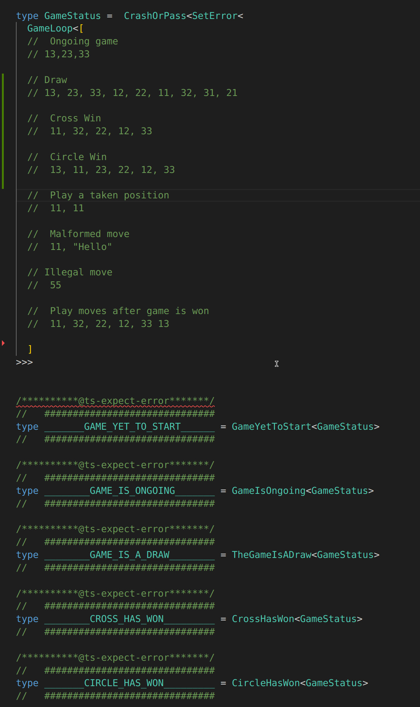

At [Mirdin](https://mirdin.com/) we help students to practice writing software. You might be familiar with how practicing guitar or some sport is very different from just playing/performing.

You will get better from just playing but it takes much longer and your understanding of what you have learned is much worse. You will learn what to do but have a harder time explaining what you have learned.   

It's exactly how it normally is to work towards becoming a senior engineer. Senior engineers that have been through a lot gain intuition. They know that one design decision should be taken over another but they might have a hard time explaining exactly why. So do you really have to spend 10 000 hours just working on projects to 
achieve mastery ?


At Mirdin we believe there is a more effective way.
We try to give meaning behind every design decision to not have to use gut feeling or past experiences with similar design decisions to have an opinion on what direction to take.

One way we do this is by giving students a series of short design exercises that takes just a few hours to finish but will contain a lot of opportunities for things to go wrong. Then we give the students immediate feedback on how their earlier design choices affected later requirements. With smaller groups or private students, we design specific requirements for each implementation that are meant to poke holes at a student's design. 

The Tic-Tac-Toe challenge is not exactly in this vain but instead gives students the challenge to write a Tic-Tac-Toe program that cannot go wrong, and produce compile time errors for as many incorrect uses as possible. For example, playing with the same player twice. 

When I was a student at Mirdin a few years ago I decided to try to write Tic-Tac-Toe completely on the typelevel in TypeScript. This proved to be very challenging but fun. I have now expanded on that initial attempt and written this post to explain how it works in the hope to teach some more advanced typelevel TypeScript.
And maybe also make you interested in doing something similar for fun.

I have a lot to thank the excellent Type-Challenges for helping me learn enough type-level trickery to get it done. 
https://github.com/type-challenges/type-challenges

## The post

This is going to be a post about advanced type-level programming.  I’ll be showing you a sequence of functions, from top to bottom (mostly). I recommend treating each snippet like a puzzle. Try to understand how each of them works as you go along until you feel you could have written it yourself. We’ll start off small, with some academic-seeming type tweaks, but pretty soon you’ll find implementing type-level board logic a piece of cake.

I showed it to Jimmy and he was dismissive . He’s a PL Ph. D. with 10 years in Haskell, and finds type-level programming easy and uninteresting. After finishing the whole post he had a funny reaction, and shared the draft with his friends.


I hope you can have a similar experience but maybe get past the 'I Hate it' 
quicker! 

It was also his idea to add the `___DISPLAY___` that i will show you in just a sec, thanks for that Jimmy! 

Let's go! 


### Where to find the code?
The latest code can be found [here](https://github.com/note89/typelevel-tic-tac-toe/blob/master/tic-tac-toe.ts) just paste it into [typescript-playground](https://www.typescriptlang.org/play) to follow along.
</br>
TypeScript Playground as of `2022-09-07` <a href="https://tinyurl.com/ts-tic-tac-toe">
https://tinyurl.com/ts-tic-tac-toe
</a>

## First end-result demo!

There is gonna be a lot of code so to peak your interest let me present you with the end-result.
A UI for playing Tic-Tac-Toe on the typelevel where type errors are used display the state of the game and provide feedback for correct play.

```typescript
// ##################################
// ##################################
// #          Play a Game           #
// #              of                #
// #--------------------------------#
// #           Typelevel            #
// #          Tic-Tac-Toe           #
// #--------------------------------#
// #              UI                #
// #          STARTS HERE           #
// ##################################
// ##################################
// 
// This is my attempt of a decent UX (hehe).
// 0. Select game board size (3 => 3x3, 4 => 4x4, etc) 
// 1. Cross will be the first to move
// 2. Just enter coordinates as number 
//    (13 => Coordinate(x=1, y=3))
// 
// The status checks below will turn RED 
// To show what state the game is in.
//
// Illegal moves will be compile-time errors
// with decent error messages.
//
// Hover ___DISPLAY__ for a visual representation
// of the current state of the game.
```

### Display


### Current state highlighting


### Error handling


##  Requirements  

If you would like to give this a try yourself, here are the requirements.

Design an API for a Tic-Tac-Toe board, consisting of types
representing states of the board, along with functions 
`move`, `takeMoveBack`, `whoWonOrDraw`, and `isPositionOccupied`.

* All functions must be pure
* All functions must return a sensible value and may not throw exceptions
* A move can only be made if
  - the game is not over
  - the player is the current player
  - the `move` is valid (i.e. not already played)
* Calling `TakeMoveBack` on a board with no moves is a compile-time error
* Calling `WhoWonOrDraw` on a tic-tac-toe board but the game has not finished is a compile-time error
* `IsPositionOccupied` works for in-play and completed games.

## Some extra design decisions
I wanted the game to be possible to play on boards of any size, (3x3, 4x4, 5x5, etc).
To achieve this the winning positions need to be calculated from `Size` instead of hard-coded. 
This is possible but a bit fiddly. I have not yet achieved the ability to have two games of different `Size` in the same project. To do that I would have to parameterize the program a bit more, this is something to try in a later version (famous last words). 

## Show me the code! 

The reason this is written in TypeScript is that it's the language I know best, and also the language I want to get better at the most but also TypeScript has a bunch of typelevel features that very few other mainstream typed languages have. 

We will go through the code top to bottom, except for the "UI" code, which will be left for last.
There are a lot of comments in the code that are also meant to explain the program, so I will reuse them here.
<style>
details{
 background: #ededed; 
 border-radius:5px; 
 padding: 10px;
 margin-bottom:10px;
}

summary {
  cursor: pointer;
  user-select: none;
}

html {
  scroll-behavior: smooth;
}
</style>

<div style="background:rgba(255,99,71,0.9);  padding: 10px; border-radius: 10px;">
  <h4 style="color: yellow; margin: 0px; padding: 15px 0px;"><b>A Note about Utils</b></h4>
  <div class="font" style="color: #fafafa; ">The code contains a quite extensive section of utility functions, 
  Instead of going though all of them first, the explanation is inlined as a optional reading at first use. So if you are more interested in how to model the problem and would like to be able to take functions like `UnionToIntersection` for granted you can. 

  But if you really want to know how that is implemented you can by clicking the arrow next to the section
  </div>

  <details>
  <summary>Util name: Click here to expand</summary>
    Here is an explanation.
  </details>
</div>


## Capturing the concepts contained in Tic-Tac-Toe
### Player


```typescript
type Player = Cross | Circle;
  interface Circle { __type: "O";     }
  interface Cross  { __type: "X";     }
```

We use `interface` instead of `type` to get the type-level information 
(when you hover / or read a compile time error) to show `Circle`
instead  `{__type: "Circle"}` which it would do with `type`.
It makes it a bit more pretty (not much more difference than that). 

### Square
```typescript
type Square = Player | Empty;
  interface Empty  { __type: "Empty"; }

```

### Size
```typescript
// ##############################################
type Size = GameSize;
// ##############################################
```

The `GameSize` is set to `3` for this walk-through. </br>
_(Size was here before i made the UI at the top therefore the redeclaration)_

### Column & Row
```typescript
// Column and Row can potentially be different sizes
// Note: winning on the diagonal will have to change 
// If the game is not square.
type Column      = ToUnion<FromToInc<1,Size>>;
type Row         = ToUnion<FromToInc<1,Size>>;
type Coordinates = CartesianProductString<Column, Row>
```


The type of `Column` and `Row` is (in this case) `1 | 2 | 3`.
First, we generate numbers between `1` and `Size` which gives us`[1,2,3]`
then we turn that into a union and end up with `1 | 2 | 3`.

`Coordiantes` have the type instance of  
`"22" | "21" | "23" | "12" | "11" | "13" | "32" | "31" | "33"`. 


##### Utils used
<!-- Arithmetic START -->
<details>
<summary>Arithmetic: FromToInc, FromToDec, PlusOne, MinusOne</summary>
<h3>Arithmetic</h3>

In a `3x3` game, `11,22,33` form a diagonal, in a `4x4` game the diagonal is `11,22,33,44`. 
Any player that has one of these diagonals has won the game.

To be able to derive diagonals and other winning positions from  `Size` we need the ability to do some
math on the typelevel. Luckily that is very possible in TypeScript.
Our needs contain only the ability to do plus and minus one. This ability will allow us to perform 
typelevel recursion.

With many of these more exotic recursive types, there is a limit to how far they will work and 
sometimes there are issues, which means you will have to try something different.
A recursive type in TypeScript 4.5 has a max call stack of [`999`](https://github.com/microsoft/TypeScript/pull/45711/files#diff-d9ab6589e714c71e657f601cf30ff51dfc607fc98419bf72e04f6b0fa92cc4b8R15233)


```typescript
// MinusOne<N>
// Defined between 1 and 1000
// Take a number N
// Check if length of empty array + 1 unknown element 
// is equal to N, if it is, return length of array 
// which then is one less then N.
// If not, recursively call MinusOne with an array 
// that is one element longer.
type MinusOne<N extends number, Arr extends any[] = []> = [
  ...Arr,
  unknown
]['length'] extends N
  ? Arr['length']
  : MinusOne<N, [...Arr, unknown]>

// PlusOne<N>
// Defined between 0 and 999
// Start with an array of length 0 and check if it is 
// equal to N. 
// If it is add one element to the array and return 
// it's length.
// If not recursively call PlusOne with an array that is 
// one element longer.
// This way we get N + 1
type PlusOne<N extends number, Arr extends any[] = []> = 
  [...Arr]['length'] extends N
    ? [...Arr, unknown]['length']
    : PlusOne<N, [...Arr, unknown]>

// FromToInc<Lower,Higher>
// Gives back an Array of all numbers 
// between Lower and Higher (inclusive)
// Example: FromToInc<1,3> = [1,2,3]
type FromToInc<From extends number, 
               To extends number, 
               acc extends any[] = []> = 
        From extends PlusOne<To> 
          ? acc 
          : FromToInc<PlusOne<From>, To, [...acc, From]>;

// FromToDec<Higher,Lower>
// Gives back an Array of all numbers 
// between Higher and Lower (inclusive)
// Example: FromToDec<3,1> = [3,2,1]
type FromToDec<From extends number, 
              To extends number, 
              acc extends any[] = []> = 
        From extends MinusOne<To> 
          ? acc 
          : FromToDec<MinusOne<From>, To, [...acc, From]>;
```
</details>
<!-- Arithmetic END -->

<!-- UTIL ToUnion START -->
<details>
<summary style="cursor: pointer; user-select:none">To Union</summary>
<h3>To Union</h3>

```typescript
// Example: ToUnion<[1,2,3]> = 1 | 2 | 3
type ToUnion<T extends Array<any>> = T[number]
```

Array has a index signature of `number`
```typescript
// something like
type Array<T> = { [index: number]: T ...}
```
So by indexing with `number` we get back `T`.
See [index-signatures](https://www.typescriptlang.org/docs/handbook/2/objects.html#index-signatures) for more info.

`ToUnion` is purely to have a nicer API that explains better what is being done.

</details>
<!-- UTIL ToUnion END -->


<!-- Cartesian Product START -->
<details>
<summary>Cartesian Product</summary>

<h3>Cartesian Product</h3>

```typescript
// CartesianProduct<X,Y>
// Example: 
// CartesianProduct<"a" | "b", "c" | "d"> = "ac" | "ad" | "bc" | "bd"
type CartesianProductString<T1 extends ToStringableTypes,T2 extends ToStringableTypes > = `${T1}${T2}`;
type ToStringableTypes = string | number | boolean | bigint;
```
```typescript
type Cartesian...<T1 extends ... ,T2 extends ...> = ${T1}${T2}
```
`T1` and `T2` can both be a union with multiple members.
Say
```typescript
T1 = "a" | "b" | "c" 
T2 = "d" | "e" | "f"
```
which gives us 

```typescript
${ "a" | "b" | "c" }${ "d" | "e" | "f" }
```

We have three choices for the first part of the string, and three choices for the second part.
So for each choice we have three other choices to choose from
```typescript
`a${"d"| "e" | "f"}` | `b${"d" | "e" | "f"}` | `c{"d" | "e" | "f"}`
```
If we multiply the three choices for the second part, we get the cartesian product of the two initial types.
```typescript
"ad"| "ae" | "af" | "bd" | "be" | "bf" | "cd" | "ce" | "cf"
```


[The Algebra of algebraic data types](https://gist.github.com/gregberns/5e9da0c95a9a8d2b6338afe69310b945)
Is a great resource if you want to learn more about this
and after reading that, you can see that
we need a member from both `T1` and `T2`, so we have `T1 * T2 choices`.
So for our `T1` and `T2` of `"a" | "b" | "c"` and `"d" | "e" | "f"`  we have
`3 * 3 = 9 possible pairs`

```typescript
// Algebraic refactoring
 1 + 1 + 1 + 1 + 1 + 1 + 1 + 1 + 1 = 9
 "ad"| "ae" | "af" | "bd" | "be" | "bf" | "cd" | "ce" | "cf"

 (1 * (1 + 1 + 1)) + (1 * (1 + 1 + 1)) + (1 * (1 + 1 + 1)) = 9
 `a${"d"| "e" | "f"} | `b${"d" | "e" | "f"}` | `c${"d" | "e" | "f"}`

 (1 + 1 + 1) * (1 + 1 + 1) = 9
`${ "a" | "b" | "c" }${ "d" | "e" | "f" }` 
 (3) * (3) = 9
 ```

A goal in the program is that as much as possible of the types are derived from other more basic types. 
The `CartesianProduct` function is used to produce coordinates between `Rows` and `Columns`, 
```typescript
// simplified
type AllCoordinates = 
  CartesianProduct<Columns,Rows> = Col1Row1 | Col2Row1 | ... | Col1Row2
```
</details>
<!-- Cartesian Product END -->


#### _Side note_
_Actually, the type of Column and Row is `2 | 1 | 3`._
_When you define a union like `type A = 1 | 2 ` the type will become `A = 2 | 1` which on the typelevel is equivalent, however, in this application, we very much care about traversal order and numbers being in order so we need to do some extra tricks sometimes to combat this._
_Maybe TypeScript makes no guarantees on the order of union members, so by scrambling them on purpose
it hinders people from depending on something that is not part of the spec._


### Winning positions

 The way we are going to see if a player has won yet
 is by using the fact that we know what combination of
 positions are winning, if a player has all of them they have won.
 Steps:

 1. Create a union of all the winning positions
    ```typescript
    ["11", "12", "13"] | ["21", "22", "23"] | ... 
    ```

 2. Check what the current state of all of them are
    ```typescript
    [Circle, Cross, Empty] | [Circle, Circle, Circle] ... 
    ```

 3. Create an intersection those states, and remove the array/tuple
    ```typescript
    [Circle & Cross & Empty] | [Circle & Circle & Circle] | ... 
    [never] | [Circle]
    never | Circle
    Circle
    ```

 Only time we get a value is when **all three are the same**

 Now we can check if the player is the winner, 
 by checking if the intersection contains a player.
 ```typescript
 PlayerCircle extends Intersection ? true : false
 ```

```typescript
// WinningPositions
// All the winning positions for a Tic-Tac-Toe game.
// Example
// ["11", "12", "13"] | ["21", "22", "23"] | ...
type WinningPositions =
  // Rows
  | GetRowPositions<Column, Row>
  // Columns
  | GetColumnPositions<Column, Row>
  // Diagonals
  | GetDiagonalPositions<Size>

// ###################################
// #### Winning Positions Helpers ####
// ###################################

type GetRowPositions<C extends Column, R extends Row> = 
    R extends Row 
      ? [CartesianProductString<C, R>] 
      : never;

type GetColumnPositions<C extends Column, R extends Row> = 
    C extends Column 
      ? [CartesianProductString<C, R>] 
      : never;

type GetDiagonalPositions<S extends Size> = 
    StringConcatTuples<Diagonals<S>>

// Only first type parameter is allowed to be supplied
type Diagonals<
      Size extends number, 
      _FromToSize extends number[] = FromToInc<1,Size>, 
      _SizeToFrom extends number[] = FromToDec<Size, 1>, 
      > =  
    | Zip<_FromToSize, _FromToSize> 
    | Zip<_FromToSize, _SizeToFrom>


```

`WinningPositions` is just the union of all positions that are winning. A position for us is just a combination(array) of coordinates. _(A chess position is not just a bunch of squares but also the pieces on those squares so maybe `WinningPositions` is not the best name)._


`GetRowPositions` and `GetColumnPositions` "iterates" through either row or column and
then creates the Cartesian product between those values. 
In code, it would read something like 
```typescript
forEach(Row).map((r) => getCatesianProduct(Column, r))
```
So the output is `["11", "21", "31"] | ["21", "22", "23"] ...` for `Row` for example. 
When you do `R extends Row ? ... | ...` in TypeScript, that is "looping" over `R` and creating a union of all the results.
The details of this are discussed in great detail in the <a href="#union-to-intersection">`UnionToIntersection`</a> util explanation.

`Diagonals`  have two parameters that are not allowed to be used when calling the type-level function. 
This is so they can be used to bind the result of a typelevel function to allow for reuse in the function body.

Here we are generating two arrays `[1,2,3]` and `[3,2,1]` and then we do two `Zip` operations
```typescript 
Zip<[1,2,3],[1,2,3]> 
```  
and 
```typescript
Zip<[1,2,3],[3,2,1]>
``` 
which produces `[[1,1],[2,2],[3,3]]`
and `[[1,3],[2,2],[3,1]]` 

We then turn each tuple into strings using `StringConcatTuples` in `GetDiagonalPositions`. Resulting in
`["11", "22", "33"]` and `["13", "22", "31"]`.


##### Utils used

<!-- ZIP START -->
<details>
<summary>Zip</summary>
<h3>Zip</h3>

```typescript
// Zip two arrays together
// Example: 
// Zip<[1,2,3],["a","b","c"]> = [[1,"a"],[2,"b"],[3,"c"]]
type Zip<
      T extends any[], 
      U extends any[], 
      Acc extends any[] = []
      > = 
  T extends [infer Head, ...infer Tail] ? 
  U extends [infer Head2, ...infer Tail2] ? 
  Zip<Tail, Tail2, [...Acc, [Head, Head2]]> : Acc  : Acc;

```
Zip is a quite simple recursive function looking very much like the code version would, there is some neater ways where you would infer both heads and tails at once. 
https://github.com/type-challenges/type-challenges/issues/4495

But with that implementation TypeScript fails to do type inferencinging later in the program.
</details>
<!-- ZIP END -->

<!-- String Concat Tuples START -->
<details>
<summary>String Concat Tuples</summary>
<h3>String Concat Tuples</h3>

```typescript
// Join tuples together to strings
// Example: 
// StringConcatTuples<[[1,2],[3,4]]> = ["12","34"]
type StringConcatTuples<T extends [number, number][]> = 
  {[Key in keyof T]: `${T[Key][0]}${T[Key][1]}`};
```
`StringConcatTuples` is so we can use coordinates as keys, and do a lookup from coordinate to a square.

We use [mapped types](https://www.typescriptlang.org/docs/handbook/2/mapped-types.html)
since it allows us to loop over the members in a type
`keyof` gives us a type that is the union of all the `keys` in `T`.
</details>
<!-- String Concat Tuples END -->


### Board

```typescript
// Fundamental data type of the game.
// Board contains a mapping from Coordinate to Square
// A Square is either Empty, Cross, or Circle.
type Board = { [s in Coordinates]: Square };
```

## Game States
```typescript
// The game can be in one of three states:
// 1. Round in progress
// 2. Won
// 3. Draw
type GameStates = 
  | Round<any, any, any> 
  | Winner<any, any, any>
  | Draw<any, any> 
```

### Round
```typescript
// ###################################
// ####           Round           ####
// ###################################
// 
// A Round has a bunch of Squares and a Player that is next 
// to move. It also has a previous Round or Nil, 
// to be able to allow for undoing moves.
interface Round<
  B extends Board,
  P extends Player,
  R extends Round<any, any, any> | Nil
> extends HasPrevious<R> {
  __tag: "round";
  board: B;
  nextToMove: P;
}
  interface Nil    { __type: "Nil";   }

// We separate our HasPrevious interface from the 
// Round interface.To be able to use it in other interfaces.
// And have type level functions where the only 
// constraint is that it has the HasPrevious interface.
interface HasPrevious<R> {
  previous: R;
```


### Winner

```typescript
interface Winner<
  S extends Player,
  PrevR extends Round<any, any, any>,
  Curr extends Board
> extends HasPrevious<PrevR> {
  __tag: "winner",
  winningPosition: Curr;
  winner: S;
}

```

### Draw
```typescript
interface Draw<R extends Round<any, any, any>> 
    extends HasPrevious<R> {__tag: "draw";}
```


#### Initial board & round

```typescript
type InitialBoard = { [key in keyof Board]: Empty };
type InitialRound = Round<InitialBoard, Cross, Nil>;
```

#### Game State Helpers
```typescript
type GetBoard<R extends GameStates>
                  = 
                    R extends Draw<any, infer B>         ? B
                  : R extends Round<infer B, any, any>   ? B
                  : R extends Winner<any, any, infer B>  ? B
                  : never;
```

## Game actions

### Move
There is only one action, it's to make a move.

```typescript
// ...
// Last two arguments are not allowed to be passed in, 
// It's used to reduce duplication in the function body.
type Move<
  CurrentRound extends Round<Board, P, any>,
  P extends Player,
  Position extends AvailableSquares<CurrentRound["board"]>,
  _NextBoard extends Board = 
    SetSquare<CurrentRound["board"], Position, P>,
  _NextRound extends Round<any,any,any> = 
    Round<_NextBoard, GetNextPlayer<P>, CurrentRound>
> = 
HasWon<P,_NextRound> extends true ?
  ? Winner<P, CurrentRound, _NextBoard>
  : NoMoreSquares<_NextBoard> extends true
    ? Draw<CurrentRound, _NextBoard>
    : _NextRound
```
Move steps:
1. Check if the position is part of `AvailableSquares[CurrentRound['board']]`
2. Create two variables, which are the board and round after the move has been applied
   `_NextBoard` and `_NextRound`
3. Check if player has won in the `_NextRound`, if `true` return `Winner<P, ...>`
4. Check if the game will have no more squares after this move, if true return `Draw<...>`
5. Else return next Round.

## Game state functions

### Available Squares
```typescript
// Squares that are possible to play on
type AvailableSquares<B extends Board> = {
  [Coordinate in keyof B]: B[Coordinate] extends Empty ?
        Coordinate 
      : never;
}[keyof B];
```

`AvailableSquares` loops through the coordinates and replaces every square with either the `Coordinate` or `never`
```typescript
{
 "11": never, 
 "12": "12",
 ...
}
```
We then lookup all values for all keys with `[keyof B]` this produces a union like 
`never | "12" | ... ` and since `never` represents the absence of a value.
`never` gets removed from unions leaving only the squares that are possible to play.

### Get next player
Toggles between the players
```typescript
type GetNextPlayer<P extends Player> = 
  P extends Cross ? Circle : Cross;

```

### Set square
Find and replace what is on a square, by looping through all coordinates
until we find the one we want to set.
```typescript
// Sets a Square to a Player
type SetSquare<B extends Board, CoordinateToSet, Player> = {
  [Coord in keyof B]: Coord extends CoordinateToSet ?
      Player 
    : B[Coord];
};
```
### No more squares

If the `Board` extends `never` that means there was nothing in the union
returned by `AvailableSquares<B>`, thus there are no more squares to play on.
```typescript
type NoMoreSquares<B extends Board> = 
  AvailableSquares<B> extends never ? true : false;
```
### Get winner
```typescript
// If there is a winner in the Squares provided then 
// the winner is returned.
type GetWinner<B extends Board> =
   UniqueInSequence<LookupCoordinates<WinningPositions,B>>

// LookupPosition returns the state of the squares 
// at each position listed
// ["11", "12", "13"] | ... -> [Circle, Circle, Circle] | ..
type LookupCoordinates<
        Coords extends Array<Coordinates>, 
        B extends Board> =
    { [Key in keyof Coords ]: B[Coords[Key]] }

// If there is any Array that contains only the same element
// then that element will be returned
type UniqueInSequence<P extends Array<unknown>> =
  P extends Array<unknown> ? 
    UnionToIntersection<P[number]> : never

```

We use the `WinningPositions` together with a `Board` to look up the state of all those winning tuples.
We then see if any of those tuples of coordinates only contain one player.

`GetWinner` might not be the perfect name, because it gives back whatever is unique in a winning set of squares so for example it would return `Empty` for the initial board. 
*(So the game starts out with `Empty` as a winner one could say)*

#### Utils used

<!-- Union To Intersection START -->
<details id="union-to-intersection">
<summary>Union To Intersection (very long!)</summary>
<h3>Union To Intersection</h3>

This is going to be the longest explanation in the whole post (it even has a quiz!)
so bear with me. I think this can be very instructive if you don't already know all this
at a deep level. This was very useful for me to write if nothing else.


```typescript
// UnionToIntersection<X>
// Takes a union like `A | B | C` and 
// returns an intersection like `A & B & C`
type UnionToIntersection<U> = 
  _PutUnionMembersIntoFunctionArgumentPosition<U> extends 
      ((k: infer I)=>void) 
          ?  I 
          : never

type _PutUnionMembersIntoFunctionArgumentPosition<U> = 
      U extends any 
        ? (k: U)=>void  
        : never;
```
The creator of `UnionToIntersection` is as far as i know [Jcalz](
https://github.com/microsoft/TypeScript/issues/29594#issuecomment-507673155
)

It's not much code is it, but there is a lot to unpack! and it's worthy of a through 
explanation.
The function has been somewhat of a debated topic, if it's a hack or not?, and if it should be included in official `lib.d.ts` or not.
I'm most certainly don't think this is a hack at all, if this would break in a future version of 
TypeScript, i think that would break a lot of other things too.

Sources where i learned about this function
* https://stackoverflow.com/questions/50374908/transform-union-type-to-intersection-type/50375286#50375286
* https://github.com/microsoft/TypeScript/issues/29594#issuecomment-507673155


There are two parts to the `UnionToIntersection` function and i will go through them separately now.

### PART 1
```typescript
type _PutUnionMembersIntoFunctionArgumentPosition<U> = 
      U extends any 
        ? (k: U)=>void  
        : never;
```

This is using `U` as a 'naked' type parameter.
Seems this lingo is no longer part of the [official docs](https://www.typescriptlang.org/docs/handbook/2/conditional-types.html#distributive-conditional-types), which is a shame,
will make it harder to understand, why things act like they do.


[Naked type parameters distributes over a union](https://stackoverflow.com/questions/51651499/typescript-what-is-a-naked-type-parameter
). 
This means the conditional part will be applied to each member of the union.
and the result will be a union of all applications of the conditional.
)

Let me show you. 

```typescript
type _PutUnionMembersIntoFunctionArgumentPosition<U> = 
      U extends any 
        ? (k: U)=>void  
        : never;

type ABC = "a" | "b" | "c"
type _ = _PutUnionMembersIntoFunctionArgumentPosition<ABC>
```

#### Replacement steps naked type param
To Replace `U` with supplied type `ABC` in the body 
of `_PutUnionMembersIntoFunctionArgumentPosition` 
check if `U` is 'clothed' or 'naked'. 
`U` is naked do a replacement for each member in 
`ABC` and make a union of the results.

```typescript
  "a" extends any ? (k: "a")  => void : never 
| "b" extends any ? (k: "b")  => void : never 
| "c" extends any ? (k: "c")  => void : never
```

Which simplifies to 
```typescript
  (k: "a")  => void  
| (k: "b")  => void  
| (k: "c")  => void
```

#### Common error
Many people (including myself in the past) think that a type parameter
get's inlined into the type level function like.

```typescript
_PutUnionMembersIntoFunctionArgumentPosition<"a"|"b"|"c">
("a" | "b" | "c") extends any ? 
  (k: "a" | "b" | "c")  => void : never
```


# **-------- THIS IS WRONG! --------**


To get that behavior, the type parameter need to be 'clothed'.

#### Clothed example

```typescript
_PutInFunctionArgumentPosition<U> = 
    [U] extends [any] 
        ? (k: U)=>void 
        : never

type ABC = "a" | "b" | "c"
type _   = _PutInFunctionArgumentPosition<ABC>
```

#### Replacement steps clothed type param
To Replace `U` with supplied type `ABC` in the body of 
`_PutInFunctionArgumentPosition` check if `U` is 'clothed' or 'naked'. 
`U` is 'clothed' so do the replacement **inline**.

```typescript
(["a" | "b" | "c"] extends [any] ? 
    (k: "a" | "b" | "c")=>void : never)
```

Which simplifies to
```
(k: "a" | "b" | "c") => void
```

### QUIZ 
To test yourself on the difference between 'naked' and 'clothed',
Think of the results of `Inline` and calling the functions
with `ABC` and `ABC3`

```typescript
type ABC  = "a" | "b" | "c"
type ABC3 = ABC | 3

type ABC_Inline_Extends_A      = ABC extends   "a"    ? 
                                     (k: ABC) => void 
                                    : never
type Naked_Extends_A<T>        =  T  extends   "a"    ? 
                                     (k:  T ) => void 
                                    : never
type Naked_Extends_String<T>   =  T  extends  string  ? 
                                     (k:  T ) => void 
                                    : never
type Clothed_Extends_String<T> = [T] extends [string] ? 
                                     (k:  T ) => void 
                                    : never
```

#### QUIZ Answers
https://tinyurl.com/typescript-quiz

_Note:_
_If we would change the type of `_PutUnionMembersIntoFunctionArgumentPosition` to be
`(k: U) => void`, we would also get `(k: "a" | "b" | "c") => void`.
We need the `U extends any ?` to distribute the union._

Moving on....

### PART 2 ###
```typescript
...PART1 extends ((k: infer I)=>void) ? I : never
```

So Part 1 gave use the result
```typescript
  (k: "a")  => void  
| (k: "b")  => void  
| (k: "c")  => void
```

We are not replacing any type-parameter in PART2, so we can just 
inline the results from calling `_PutUnionMembersIntoFunctionArgumentPosition<U>`.

```typescript
(    (k: "a")  => void) 
   | (k: "b")  => void) 
   | (k: "c")  => void)
) extends ((k: infer I)=>void) ? I : never
```

(If you have not heard about `infer` before look at these docs.
https://learntypescript.dev/09/l2-conditional-infer)

We are saying here that there is a function  
```typescript
((k: infer I) => void) 
```
that can be either      
```typescript
     (k: "a") => void 
  or (k: "b") => void 
  or (k: "c") => void
```
**It's not the argument to the function that can be `"a" | "b" | "c"`.
There are three separate functions with those argument, and we DON'T know which one we will have.**
Therefore ghe only **SAFE** argument to 
```typescript
((k: infer I) => void) 
```
the intersection of all possible arguments.

That might had been a bit confusing, so let's look at one example

```typescript
type T = (k: HasName) => void | (k: HasAge) => void
const func : T = ...
```

If we now want to call `func` what argument do we need to give it ?

Well we don't know if `T` is 
```typescript
   (k: HasName) => void 
or (k: HasAge)  => void
```
So we need to call `func` with an argument **that is both**. 

```typescript
type Dog = HasName & HasAge
const dog : Dog = createDog("Fido", 3)
func(dog)
```

_Thank AnyHowStep for this [answer](
https://github.com/microsoft/TypeScript/issues/29594#issuecomment-507701193
) that helped me write this section_
</details>
<!-- Union To Intersection END -->

### Has Won
```typescript
type HasWon<
  P extends Player,
  B extends Round<any, any, any>
> = P extends GetWinner<B["squares"]> ? true : false;
```

## Extra functions from requirements

### Who won or draw ?
Just a function that gives back a string informing 
who won or if it's a draw, only possible to call when the game state is 
either `Draw` or `Winner`

```typescript
type WhoWonOrDraw<
    A extends Draw<any,any> 
  | Winner<Player, any, any>> = (
  state: A
) => A extends Winner<infer P, any, any>
  ? PlayerWinnerString<P>
  : DrawString;
  type DrawString = "The game was a draw";

type PlayerWinnerString<P extends Player> = 
  P extends Circle ? 
    CircleWonString
  : CrossWonString
  type CircleWonString = "Circle Won the game"
  type CrossWonString = "Cross Won the game"

```

### Take move back
Any round except the initial round has a previous round. 
This function gives back that previous round.

```typescript
type TakeMoveBack<
        R extends HasPrevious<Round<any, any, any>>
        > = 
        R["previous"];
```

### Is position occupied?
```typescript
type IsPositionOccupied<
  RW extends Winner<any, any, any> | Round<any, any, any>,
  Coord extends Coordinates,
  B extends Board = GetBoard<RW>
> = (
  B[Coord] 
) extends Empty
  ? false
  : true;
```

**That is all the code related to the fundamentals of the game!**

There is some extra code for the 'Game UI' to play the game in a nicer
way than you will see in the tests.
We will go through that code last.

# Tests

Note, since these are `typelevel` tests we want to be able
to test that we do get `type-errors`, when we should while 
allowing the program to compile. TypeScript gives us this handy comment we can use to check for type errors.
> `@ts-expect-error`
<a href="https://www.typescriptlang.org/docs/handbook/release-notes/typescript-3-9.html#-ts-expect-error-comments" target="__blank">`@ts-expect-error`</a> gives an error if there is **no** error.

### Test Utils

We need some type-level utility functions to help us with 
the game. `Equal` and `Expect` functions have been taken from 
the excellent 
<a href="https://github.com/type-challenges/type-challenges/blob/master/utils/index.d.ts" target="__blank">
type-challenges 
</a>
repo.

```typescript
Equal<X,Y> 
Check if two types are equal.
```
For full discussion around this <a href="https://github.com/Microsoft/TypeScript/issues/27024#issuecomment-421529650" target="__blank">TypeScript issue</a>

> ...It relies on conditional types being deferred when T is not known. 
> Assignability of deferred conditional types relies on an internal isTypeIdenticalTo check, 
> which is only true for two conditional types if:
> 
>   * Both conditional types have the same constraint
>   * The true and false branches of both conditions are the same type
> <a href="https://github.com/Microsoft/TypeScript/issues/27024#issuecomment-510924206">
> - fatcerberus</a>


```typescript
type Equal<X, Y> = 
  (<T>() => T extends X ? 1 : 2) extends 
  (<T>() => T extends Y ? 1 : 2) ? true : false;

// Expect<T>
// Give type-level error if T is not true
type Expect<T extends true> = T;

```
### Test cases
```typescript
// ##################################
// #              TEST              #
// ##################################
// #         Correct strings        #
// ##################################
type CircleWonStringTest = 
  Expect<
      Equal<
          ReturnType<WhoWonOrDraw<WinCircleFinal>>, 
          CircleWonString
          >
        >;

type CrossWonStringTest = 
  Expect<
      Equal<
          ReturnType<WhoWonOrDraw<WinCrossFinal>>, 
          CrossWonString
          >
        >;

type DrawStringTest = 
  Expect<
      Equal<
          ReturnType<WhoWonOrDraw<DrawFinal>>, 
          DrawString
          >
        >;

// ##################################
// #              TEST              #
// ##################################
// #         No double moves        #
// ##################################
// @ts-expect-error
type NoDoubleMove = Move<
                      Move<InitialRound, Cross, "33">, 
                                         Cross, "13">;

// ##################################
// #              TEST              #
// ##################################
// #      No start with Circle      #
// ##################################
// @ts-expect-error
type NoStartWithCircle = Move<InitialRound, Circle, "33">;


// ##################################
// #              TEST              #
// ##################################
// #      No taking a used square   #
// ##################################
// @ts-expect-error
type NoTakingAUsedSquare = 
  Move<
    Move<
      InitialRound, Cross,  "33">, 
                    Circle, "33">

// ##################################
// #              TEST              #
// ##################################
// #  InitialRound has no previous  #
// #  Don't allow to take too many  #
// #           moves back           #
// ##################################
// @ts-expect-error
type NotToManyMovesBack = TakeMoveBack<InitialRound>;


// ##################################
// #              TEST              #
// ##################################
// #         Making a move          #
// #       and taking it back       #
// #   Gives back the start state   #
// ##################################
type MoveOne      = Move<InitialRound, Cross, "33">;
type BackToNormal = TakeMoveBack<MoveOne>;
type Outcome      = Expect<
  Equal<
    InitialRound, 
    BackToNormal
  >>;

type BackFromDraw = Expect<
                      Equal<
                        TakeMoveBack<DrawFinal>, 
                        DrawStep8
                           >
                          >;
type BackFromWin = Expect<
                      Equal<
                        TakeMoveBack<WinCrossFinal>, 
                        WinCrossStep4
                            >
                          >;

// ##################################
// #              TEST              #
// ##################################
// #       IsPositionOccupied       #
// ##################################
type Test = Expect<
  Equal<IsPositionOccupied<WinCrossFinal, "12">, false>
>;

type Test2 = Expect<
  Equal<
    IsPositionOccupied<WinCrossFinal, "33">, 
    true
  >>;

type Test3 = Expect<
  Equal<
    IsPositionOccupied<InitialRound, "33">, 
    false
  >>;

// @ts-expect-error
type Test4 = Expect<
  Equal<
    IsPositionOccupied<InitialRound, "33">, 
    true
  >>;

// ##################################
// #              TEST              #
// ##################################
// #    GAME That ends in a draw    #
// ##################################
type DrawStep1 = Move<InitialRound, Cross, "13">;
type DrawStep2 = Move<DrawStep1, Circle, "23">;
type DrawStep3 = Move<DrawStep2, Cross, "33">;
type DrawStep4 = Move<DrawStep3, Circle, "12">;
type DrawStep5 = Move<DrawStep4, Cross, "22">;
type DrawStep6 = Move<DrawStep5, Circle, "11">;
type DrawStep7 = Move<DrawStep6, Cross, "32">;
type DrawStep8 = Move<DrawStep7, Circle, "31">;
type DrawFinal = Move<DrawStep8, Cross, "21">;
type DrawOutcome = Expect<
  Draw<any> extends DrawFinal ? true : false
  >;


// ##################################
// #              TEST              #
// ##################################
// #     GAME That Cross Wins       #
// ##################################
type WinCrossStep1 = Move<InitialRound, Cross, "13">;
type WinCrossStep2 = Move<WinCrossStep1, Circle, "11">;
type WinCrossStep3 = Move<WinCrossStep2, Cross, "33">;
type WinCrossStep4 = Move<WinCrossStep3, Circle, "21">;
type WinCrossFinal = Move<WinCrossStep4, Cross, "23">;
type WinCrossOutcome = Expect<Equal<
   WinCrossFinal["winner"], Cross
>>;

// ##################################
// #              TEST              #
// ##################################
// #     GAME That Circle Wins      #
// ##################################
type WinCircleStep1 = Move<InitialRound, Cross, "13">;
type WinCircleStep2 = Move<WinCircleStep1, Circle, "11">;
type WinCircleStep3 = Move<WinCircleStep2, Cross, "33">;
type WinCircleStep4 = Move<WinCircleStep3, Circle, "21">;
type WinCircleStep5 = Move<WinCircleStep4, Cross, "22">;
type WinCircleFinal = Move<WinCircleStep5, Circle, "31">;
type WinCircleOutcome = Expect<Equal<
   WinCircleFinal["winner"], Circle
>>;

```


# UI 

I know it's a bit silly to call this a UI, but hey, it gives you visual indications
of the state of the game and yells at what you are doing wrong if you 
try to play the game incorrectly. 
So that is a rudimentary UI. 


<details>
<summary>UI Display Code that was shown at the beginning of the post</summary>

```typescript
// To play along
// here is a TypeScript playground of the code.
// https://tinyurl.com/ts-tic-tac-toe
//
// ##################################
// ##################################
// #          Play a Game           #
// #              of                #
// #--------------------------------#
// #           Typelevel            #
// #          Tic-Tac-Toe           #
// #--------------------------------#
// #              UI                #
// #          STARTS HERE           #
// ##################################
// ##################################
// 
// This is my attempt of a decent UX (hehe).
// 0. Select game board size (3 => 3x3, 4 => 4x4, etc) 
// 1. Cross will be the first to move
// 2. Just enter coordinates as number 
//    (13 => Coordinate(x=1, y=3))
// 
// The status checks below will turn RED 
// To show what state the game is in.
//
// Illegal moves will be compile-time errors
// with decent error messages.
//
// Hover ___DISPLAY__ for a visual representation
// of the current state of the game.
type GameSize = 3;

//   ##############################
type ____________DISPLAY___________ = d
//   ##############################

type GameStatus =  CrashOrPass<SetError<
  GameLoop<[
  //  Ongoing game
  // 13,23,33

  // Draw 
  // 13, 23, 33, 12, 22, 11, 32, 31, 21

  //  Cross Win
  //  11, 32, 22, 12, 33 

  //  Circle Win
  //  13, 11, 23, 22, 12, 33

  //  Play a taken position
  //  11, 11

  //  Malformed move
  //  11, "Hello"

  // Illegal move
  //  55

  //  Play moves after game is won
  //  11, 32, 22, 12, 33 13

  ]
>>>


/**********@ts-expect-error*******/
//   ##############################
type _______GAME_YET_TO_START______ = 
        GameYetToStart<GameStatus>
//   ##############################

/**********@ts-expect-error*******/
//   ##############################
type ________GAME_IS_ONGOING_______ = 
        GameIsOngoing<GameStatus>
//   ##############################

/**********@ts-expect-error*******/
//   ##############################
type ________GAME_IS_A_DRAW________ = 
        TheGameIsADraw<GameStatus>
//   ##############################

/**********@ts-expect-error*******/
//   ##############################
type ________CROSS_HAS_WON_________ = 
         CrossHasWon<GameStatus>
//   ##############################

/**********@ts-expect-error*******/
//   ##############################
type _______CIRCLE_HAS_WON_________ = 
        CircleHasWon<GameStatus>
//   ##############################

// ##################################
// ##################################
// #--------------------------------#
// #           Typelevel            #
// #          Tic-Tac-Toe           #
// #--------------------------------#
// #              UI                #
// #           ENDS HERE            #
// #--------------------------------#
// ##################################
// ##################################

```
</details>

### Ui Code
#### UI Helpers
```typescript
// 'd' is just to hide the variable as 
// much as possible in the UI above
type d = ShowBoard<GetBoard<GameStatus>>

// These are functions give type errors when the game is 
// not in their state.Then we combine that with 
// @ts-expect-error to flip that behavior
type TheGameIsADraw<T extends Draw<any, any>> = T
type CrossHasWon   <T extends Winner<Cross, any, any>>= T
type CircleHasWon  <T extends Winner<Circle, any, any>> = T
type GameIsOngoing <T extends 
                    Round<any, any, Round<any,any,any>>> = T
type GameYetToStart<T extends InitialRound> = T

```

I use `@ts-expect-error` to turn the type errors around. So it shows an error when the types actually type check. 
That is useful here, in the absence of something like "extends everything except X". 
```typescript
type CrossHasWon<T extends Not<Winner<Cross,any,any>>> = T
```

#### Game Loop
```typescript
type GameLoop<A extends Array<number>, 
              R extends Round<any,any,any> = InitialRound, 
              P extends Player = Cross> = 
  A extends [infer Head, ...infer Tail] ?
    Head extends number ?
      Tail extends Array<number> ?
        NumToStr<Head> extends Coordinates ?
          NumToStr<Head> extends AvailableSquares<R["board"]> ?
            Move<R,P,NumToStr<Head> > extends Round<any,any,any> ?
              GameLoop<Tail, Move<R,P,NumToStr<Head> >, GetNextPlayer<P>> : 
              Tail extends [] ? 
                Move<R,P,NumToStr<Head> > 
                : GAME_ERROR<`No more moves allowed, game is over`>
          : GAME_ERROR<`Square '${Head}' already taken`>
        : GAME_ERROR<`Coordinate '${Head}' is illegal`> 
      : GAME_ERROR<`Tail of Coordinate array is malformatted`>
    : GAME_ERROR<`Coordinate '${Head extends ToStringableTypes ? Head : never}' is not a number`>
  : R

type GAME_ERROR<T extends string> = `__ERROR__: ${T}`
type SetError<T> = [T, T extends GAME_ERROR<string> ? "error" : "noError"]
type CrashOrPass<T extends [unknown, "noError"]> = T[0];
type NumToStr<N extends number> = `${N}`
```
First of we create some data abstraction in that we allow the players to enter `number` instead 
of `Coordinate` then we do some conditional checks to see if that number can be cast into a 
`Coordinate` this makes the UI easier to use since we don't have to add `""` around all moves.

We are kind of able to simulate `X extends not<...>` (i.e type-error if X does extend) a bit with `SetError` and `CrashOrPass` which needs to be used together, I don't know how to put them together into one typelevel function or even better get `GameLoop` to have this constraint by itself. With more work, it's probably possible.

`GameLoop` is a recursive typelevel function that ends when the game ends or an error occurs.
The errors give informative information like `__ERROR__: Square '${Head}' already taken` 
I think it's really cool that we can just inject `Head` into a string and get type errors like 


To not just get a return type of a custom error but actually get a compile-time error highlighting it we wrap `GameLoop` in
`SetError` and `CrashOrPass`.
```typescript
type SetError<T> = [T, 
                    T extends GAME_ERROR<string> ? 
                        "error" 
                      : "noError"
                   ]
```
If the return type that extends `GAME_ERROR<string>` then set the second value in the tuple to `"error"`.

`CrashOrPass` then takes the return type from `SetError` and if the second value is **not** `"noError"`
we get a compile time error, which is exactly what we want.
```typescript
type CrashOrPass<T extends [unknown, "noError"]> = T[0];
```
If we do not get a compile-time error the first value of the tuple is returned 
which is just non-error type. 

_(In TypeScript types propagate if possible even if there is a type-error, like here `T[0]` is not the part with the type-error so that propagates.  We use this to also show the error in `___DISPLAY___`)_

I know it's common in Erlang and [Elixir](https://elixirschool.com/en/lessons/intermediate/error_handling) to follow this type of pattern on the value level. 
by returning `{:ok, data } | {:error, reason}`.


### Display

Best for last, the display is the coolest feature!
We want to produce a UI like 
```typescript
{
  [X,X,O],
  [X,_,O],
  [_,_,O],
}
```
To show the state of the game when hovering the type

We use the Board, to first change the Squares from 
`Circle | Cross | Empty` to `X | O | _`

Then it's a matter of producing a layout that the type-checker
will display in a nice way. String was no good because multiline
strings become `XXO\nX_O\n__O`. 
Multidimensional arrays are also just one line 
`[[X,X,O],[X,_,O],[_,_,O]`]` So settled for an object where the keys are the rows.
```typescript
{
  3: [X,X,O],
  2: [X,_,O],
  1: [_,_,O],
}
```

```typescript
// Show the state of the game when hovering the type instantiated type
type PrintGameDisplay<T extends (GameStates | GAME_ERROR<string>)> = 
  T extends GameStates ? ShowBoard<GetBoard<T>> : T

// Some shorter and nicer looking symbols for the Display
interface X {}
interface O {}
interface _ {}

// UIBoard
// Coordinates to something that we want to Display
type UIBoard = {[s in Coordinates]: unknown}

/// #### DISPLAY HELPERS ####

type ShowBoard<B extends Board> = ShowUIBoard<ToUIBoard<B>>;

// ToUIBoard
// The particular board we want to show
// Structurally, a UIBoard
type ToUIBoard<B extends Board> = {[s in Coordinates]: ChangeSquare<B[s]>};

type ChangeSquare<S extends Square> = S extends Cross  ? X
                                    : S extends Circle ? O
                                    : S extends Empty  ? _
                                    : never;

// We want our coordinate system to have 1,1 bottom left
// and Size,Size top right
type RowsBackwards  = FromToDec<Size,1>
type ColumnsForward = FromToInc<1,Size>

// ShowUIBoard
type ShowUIBoard<B extends UIBoard > = 
  {[key in keyof RowsBackwards as KeyToValue<RowsBackwards,key>]: RowsBackwards[key] extends number 
    ? TupleCoordinateLookups<Zip<ColumnsForward,Repeat<RowsBackwards[key], Size>>, B> : never} 

  type KeyToValue<T extends Array<unknown>, K extends keyof T> = 
      K extends `${number}` ? T[K] : never;

  type Repeat<T, N extends number, arr extends Array<T> = []> = 
      N extends 0 ? arr : Repeat<T, MinusOne<N>, [T, ...arr]>;

  type TupleCoordinateLookups<T extends [number, number][], B extends UIBoard> = 
    {[Key in keyof T]: TupleCoordinateLookup<T[Key], B>};

  type TupleCoordinateLookup<T extends [number, number], B extends UIBoard> = 
    `${T[0]}${T[1]}` extends keyof B ? B[`${T[0]}${T[1]}`] : never;
// ShowUIBoard End
```

I indented the types that are just helpers for `ShowUIBoard`. 
We only have some limited ability to create named type variables in a scope
which I have already shown, `<..., MyType = MyTypeFunc<T>>`
So here is another approach based only on convention and there to make the code 
easier to browse. When you have access to creating multiple files you can ofc 
create your scope that way.

`ToUiBoard` loops through all `Coordinates` and maps the members of the `Square` type to another type that we would like to display.


`ShowUIBoard` uses one trick we have not seen yet. 
https://www.typescriptlang.org/docs/handbook/2/mapped-types.html#key-remapping-via-as
it's the `as` syntax that lets us change the `key` while we are mapping. 
That is perfect here because we use the keys `0,1,2, ...Size` in `RowsBackwards`
to be mapped to the value at each index, so we get the rows of our display object.

ex. `RowArray[0]` value is `Size` 
    `RowArray[0]` value is `Size-1` 

```typescript
{
  [Size]    : ...,
  [Size - 1]: ...,
  [Size - 2]: ...,
}
```

Then for the values on each `row` we combine the column values together 
with the current row value, by using the Zip operation, where 
the second argument is just the `row` repeated column length times.

```typescript
Zip([1,2,3], [3,3,3]) = [[1,3],[2,3],[3,3]]

```
Then we do a lookup for each tuple `[x,y]` to get the 
corresponding symbol representing the state.
We do that by first turning `[x,y]` into a string `${x}{y}` 
and the end result is an object that looks like this.

```typescript
{
  3: [X,X,O],
  2: [X,_,O],
  1: [_,_,O],
}
```

And this is our display!
Now we have everything we need to produce the final product. 


### Closing thoughts.

Thanks for reading this far! I hope you learned something on this journey.  TypeScript is very powerful and you can basically do anything you want as long as you are willing to spend enough time. 
It just gets more and more awkward to achieve the constraints on the typelevel.
I would not say that this is any good practice in general, but knowing that something is possible could 
make it worth exploring in cases where it would be worth the end result.

A few years ago I was of the opinion that if you could have static guarantees you should. 
Now I still want those guarantees but I think it's very prudent and acceptable to use something like 
type guards
```typescript
if(isDog(x)){
  //do something
}
```
And write code that is still safe but does runtime checks,
usually this lead to simpler solutions. 


Don't forget to check out the next cohort of our course in Advanced Software Design.
https://jameskoppelcoaching.com/advanced-software-design-web-course/

Cheers!

 